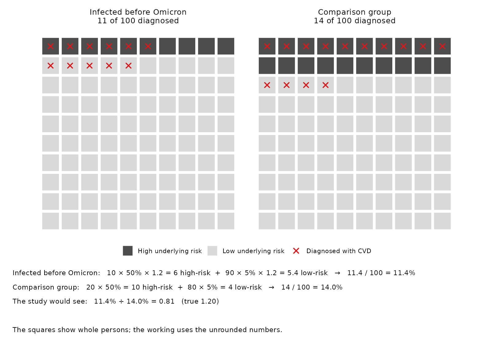
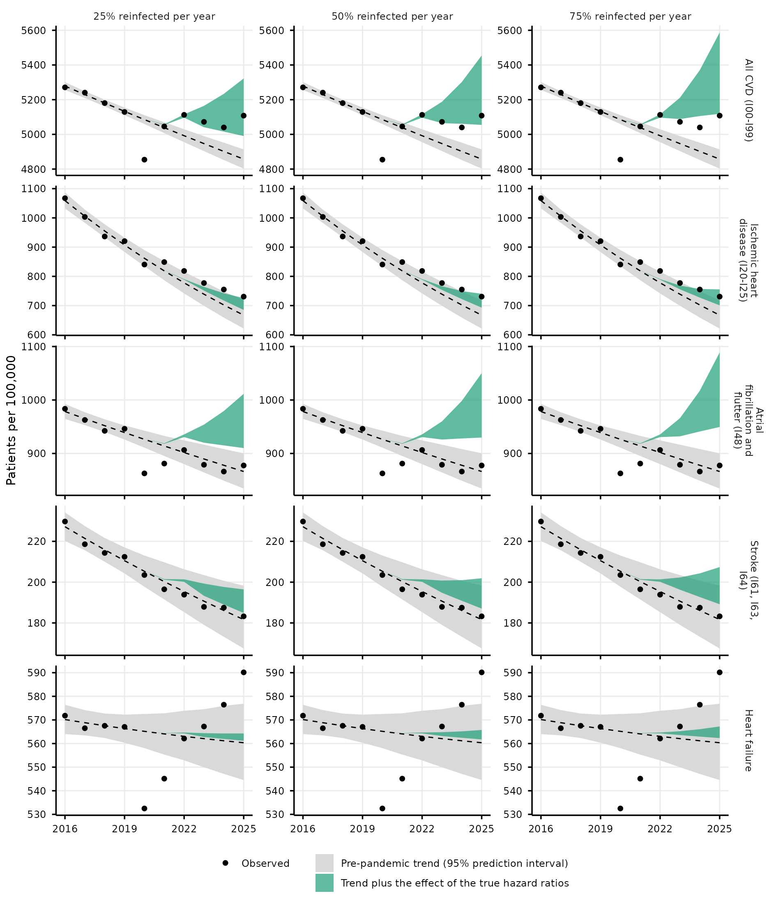

# Bias and the long-term cardiovascular risk after SARS-CoV-2 infection

Boyd et al. 2026, “SARS-CoV-2 infection and long-term risk of cardiovascular and renal morbidity” (EHJ Open, doi:10.1093/ehjopen/oeag121), report hazard ratios below 1 for most cardiovascular outcomes from 12 months after infection. Taken as causal, these estimates mean that infection protects against later cardiovascular disease. This repository holds the simulation behind our letter on that paper. In the simulation, infection increases cardiovascular risk, and an approximation of the study design still gives the published estimates.

`Run.R` simulates 10 cohorts of 4,508,489 synthetic persons, one per member of the paper’s cardiovascular cohort. It analyses each cohort as the paper does, and compares the estimates with the published ones. `Norway.R`, a supplement, compares the result with Norwegian national data. `Bias.R` shows what each source of bias contributes. `Illustrations.R` draws four small examples of how each source of bias works. `README.qmd` reads every result in this README from the files that these scripts save in `results/`.

The sections are:

1.  [Result](#result): the simulated study reproduces the published estimates from harmful true effects, with the values per outcome.
2.  [Why the estimates fall below 1](#why-the-estimates-fall-below-1): how each source of bias works, what it does in the simulation, and what the paper’s own estimates say.
3.  [The model](#the-model) and [how the simulated cohort matches the paper](#how-the-simulated-cohort-matches-the-paper).
4.  [Assumptions and limits](#assumptions-and-limits).
5.  [Supplement: Norwegian national data from NIPH/FHI](#supplement-norwegian-national-data-from-niphfhi).

## Result

At 12 months or more, every true hazard ratio in the simulation is at least 1.01, so infection is harmful for all 12 outcomes. The published estimates are below 1 for 11 of them. The simulated study, analysed as the paper does, gives the same low estimates: 55 of the 58 published point estimates (95%) lie inside the 95% prediction interval of the simulated estimates.

Each row is one of the 12 cardiovascular outcomes with the highest baseline rate. Each panel is a window since the first positive test.

- **Red dot:** the assumed true hazard ratio. It is the effect of infection on the hazard of each person, given age and frailty. It is not a population (marginal) hazard ratio.
- **Green band:** the 95% prediction interval (PI) for the estimate of one study of this size. It comes from the 10 simulated cohorts. A cohort has an estimate only if the window has at least 5 events, and a band needs estimates from at least 6 cohorts.
- **Black square and bar:** the published estimate and its 95% CI, from Supplementary Table 1.

### Values per outcome

The tables give the values in the figure, one table per outcome, in the order of the figure. The last column is the extra rate of first diagnoses in the window: the rate with infection less the rate without, per 100,000 person-years.

- **Persons:** those with a recorded infection, each simulated with and without infection.
- **Windows:** measured from the recorded infection, or from entry for an infection before entry, as in the analysis. The window of 12 months or more runs to the end of follow-up.
- **At risk:** until a first diagnosis of the outcome, death or the end of follow-up. A diagnosis of another outcome does not stop the count.
- **Death:** infection does not kill in this comparison. Each person has the same death time with and without infection.
- **Value:** the mean over the 10 cohorts.

Where the true hazard ratio is 1.01, the extra rate is close to 0 and can fall just below 0. This comes from Monte Carlo error, and from infection bringing diagnoses forward, which removes persons from risk in later windows.

#### Pulmonary embolism

| Window | True HR | Simulated 95% PI | Published HR (95% CI) | Extra per 100,000 person-years |
|:---|---:|---:|---:|---:|
| Day 0-1 | 22.75 | 11.03-21.70 | 16.10 (11.00-23.50) | 551.1 |
| Day 2 to \<1 month | 6.48 | 3.83-5.02 | 4.14 (3.57-4.79) | 144.4 |
| 1 to 5 months | 1.57 | 1.06-1.35 | 1.21 (1.08-1.36) | 15.7 |
| 6 to 11 months | 1.26 | 0.81-1.08 | 0.89 (0.78-1.02) | 7.7 |
| 12 months or more | 1.26 | 0.49-1.11 | 0.77 (0.61-0.98) | 5.4 |

#### Venous embolism

| Window | True HR | Simulated 95% PI | Published HR (95% CI) | Extra per 100,000 person-years |
|:---|---:|---:|---:|---:|
| Day 0-1 | 4.27 | 1.59-5.44 | 2.67 (1.48-4.84) | 149.0 |
| Day 2 to \<1 month | 1.69 | 1.20-1.69 | 1.42 (1.22-1.66) | 35.9 |
| 1 to 5 months | 1.23 | 1.04-1.30 | 1.12 (1.03-1.21) | 13.7 |
| 6 to 11 months | 1.23 | 1.03-1.20 | 1.09 (1.00-1.18) | 14.9 |
| 12 months or more | 1.20 | 0.66-1.12 | 0.90 (0.77-1.05) | 9.3 |

#### Inflammatory heart disease

| Window | True HR | Simulated 95% PI | Published HR (95% CI) | Extra per 100,000 person-years |
|:---|---:|---:|---:|---:|
| Day 0-1 | 5.52 | none | 4.90 (2.04-11.80) | 36.6 |
| Day 2 to \<1 month | 1.37 | 0.72-1.93 | 1.08 (0.76-1.54) | 4.2 |
| 1 to 5 months | 1.16 | 0.84-1.32 | 0.99 (0.84-1.18) | 2.0 |
| 6 to 11 months | 1.16 | 0.91-1.34 | 1.05 (0.89-1.23) | 2.3 |
| 12 months or more | 1.16 | 0.58-1.17 | 0.91 (0.67-1.23) | 0.9 |

#### Conduction disorders

| Window | True HR | Simulated 95% PI | Published HR (95% CI) | Extra per 100,000 person-years |
|:---|---:|---:|---:|---:|
| Day 0-1 | 11.13 | 5.40-17.86 | 8.85 (5.01-15.60) | 185.5 |
| Day 2 to \<1 month | 1.16 | 0.69-1.65 | 0.76 (0.53-1.09) | 3.3 |
| 1 to 5 months | 1.16 | 0.89-1.41 | 1.08 (0.94-1.24) | 3.4 |
| 6 to 11 months | 1.16 | 0.86-1.30 | 1.13 (0.98-1.30) | 3.6 |
| 12 months or more | 1.16 | 0.60-1.37 | 1.13 (0.88-1.44) | 2.9 |

#### Arrhythmias

| Window | True HR | Simulated 95% PI | Published HR (95% CI) | Extra per 100,000 person-years |
|:---|---:|---:|---:|---:|
| Day 0-1 | 9.17 | 5.56-9.95 | 7.67 (6.17-9.53) | 1134.7 |
| Day 2 to \<1 month | 1.38 | 1.10-1.39 | 1.19 (1.07-1.32) | 54.8 |
| 1 to 5 months | 1.13 | 0.97-1.18 | 1.07 (1.02-1.12) | 20.3 |
| 6 to 11 months | 1.13 | 0.97-1.09 | 1.05 (1.00-1.11) | 20.0 |
| 12 months or more | 1.12 | 0.79-0.92 | 0.90 (0.82-0.99) | 13.8 |

#### Ischemic heart disease

| Window | True HR | Simulated 95% PI | Published HR (95% CI) | Extra per 100,000 person-years |
|:---|---:|---:|---:|---:|
| Day 0-1 | 7.26 | 4.54-7.77 | 5.84 (4.21-8.11) | 542.0 |
| Day 2 to \<1 month | 1.15 | 0.94-1.26 | 1.01 (0.87-1.17) | 11.7 |
| 1 to 5 months | 1.08 | 0.99-1.11 | 0.93 (0.87-1.00) | 8.5 |
| 6 to 11 months | 1.08 | 0.90-1.10 | 1.03 (0.93-1.14) | 8.8 |
| 12 months or more | 1.08 | 0.67-1.07 | 0.89 (0.78-1.00) | 5.3 |

#### Valve disorders

| Window | True HR | Simulated 95% PI | Published HR (95% CI) | Extra per 100,000 person-years |
|:---|---:|---:|---:|---:|
| Day 0-1 | 3.22 | 1.12-6.04 | 2.51 (1.20-5.28) | 93.4 |
| Day 2 to \<1 month | 1.04 | 0.85-1.23 | 1.03 (0.83-1.28) | 1.6 |
| 1 to 5 months | 1.04 | 0.87-1.17 | 0.98 (0.89-1.08) | 1.9 |
| 6 to 11 months | 1.04 | 0.89-1.12 | 1.03 (0.93-1.14) | 2.1 |
| 12 months or more | 1.03 | 0.65-1.09 | 0.86 (0.71-1.04) | 1.5 |

#### Cerebrovascular hemorrhage

| Window | True HR | Simulated 95% PI | Published HR (95% CI) | Extra per 100,000 person-years |
|:---|---:|---:|---:|---:|
| Day 0-1 | 7.50 | 3.59-10.41 | 6.93 (3.45-13.90) | 96.1 |
| Day 2 to \<1 month | 1.28 | 0.85-1.78 | 1.19 (0.87-1.63) | 4.8 |
| 1 to 5 months | 1.01 | 0.82-1.26 | 0.86 (0.73-1.01) | 0.0 |
| 6 to 11 months | 1.01 | 0.83-1.13 | 0.96 (0.82-1.13) | 0.3 |
| 12 months or more | 1.01 | 0.51-1.20 | 0.85 (0.63-1.14) | 0.1 |

#### Other cerebrovascular

| Window | True HR | Simulated 95% PI | Published HR (95% CI) | Extra per 100,000 person-years |
|:---|---:|---:|---:|---:|
| Day 0-1 | 11.38 | 5.41-12.32 | 8.75 (5.95-12.90) | 396.8 |
| Day 2 to \<1 month | 1.27 | 0.82-1.51 | 1.15 (0.94-1.40) | 11.5 |
| 1 to 5 months | 1.08 | 0.98-1.10 | 1.01 (0.92-1.11) | 4.6 |
| 6 to 11 months | 1.08 | 0.92-1.11 | 1.02 (0.93-1.12) | 3.9 |
| 12 months or more | 1.01 | 0.63-0.99 | 0.77 (0.64-0.94) | 1.3 |

#### Cerebral infarction

| Window | True HR | Simulated 95% PI | Published HR (95% CI) | Extra per 100,000 person-years |
|:---|---:|---:|---:|---:|
| Day 0-1 | 10.35 | 6.04-12.13 | 8.29 (5.97-11.50) | 582.5 |
| Day 2 to \<1 month | 1.27 | 1.04-1.45 | 1.16 (0.99-1.37) | 19.9 |
| 1 to 5 months | 1.01 | 0.89-1.08 | 0.88 (0.81-0.96) | -0.1 |
| 6 to 11 months | 1.01 | 0.90-1.00 | 0.91 (0.83-0.99) | 0.8 |
| 12 months or more | 1.01 | 0.69-0.91 | 0.74 (0.62-0.88) | 0.2 |

#### Aneurysm dissection

| Window | True HR | Simulated 95% PI | Published HR (95% CI) | Extra per 100,000 person-years |
|:---|---:|---:|---:|---:|
| Day 0-1 | 2.98 | none | 3.85 (1.83-8.09) | 59.6 |
| Day 2 to \<1 month | 1.01 | 0.72-1.15 | 0.90 (0.68-1.21) | -0.1 |
| 1 to 5 months | 1.01 | 0.88-1.18 | 1.02 (0.90-1.15) | 0.3 |
| 6 to 11 months | 1.01 | 0.79-1.15 | 0.98 (0.86-1.11) | 0.2 |
| 12 months or more | 1.01 | 0.54-1.18 | 0.73 (0.56-0.95) | 0.2 |

#### Heart failure

| Window | True HR | Simulated 95% PI | Published HR (95% CI) | Extra per 100,000 person-years |
|:---|---:|---:|---:|---:|
| Day 0-1 | 16.21 | 7.85-20.89 | 10.80 (6.51-18.00) | 299.2 |
| Day 2 to \<1 month | 1.11 | 0.61-1.36 | 1.00 (0.73-1.37) | 1.1 |
| 1 to 5 months | 1.01 | 0.84-1.10 | 0.87 (0.73-1.01) | 0.3 |
| 6 to 11 months | 1.01 | 0.76-1.19 | 0.73 (0.62-0.87) | 0.6 |
| 12 months or more | 1.01 | 0.54-1.31 | 0.57 (0.41-0.80) | 0.7 |

### Agreement with the published estimates

- 55 of the 58 published estimates that have a band (95%) lie inside it. The 3 outside are cerebral infarction at 1 to 5 months, ischemic heart disease at 1 to 5 months, and heart failure at 6 to 11 months.
- 2 day-1 estimates have no band, because fewer than 6 of the 10 cohorts had 5 or more events: aneurysm dissection and inflammatory heart disease.
- At 12 months or more, the geometric mean of the 12 simulated estimates is 0.821, against 0.825 published.
- At 12 months or more, a mean of 5.7 of the 12 outcomes per cohort have a 95% CI below 1, against 6 published.

### Extra diagnoses

`Run.R` simulates each cohort a second time without infection. The persons, their natural death times and their event thresholds stay the same. With infection, a mean of 2,381 more persons per cohort have a CVD diagnosis. That is 52.8 per 100,000 persons, or 3.36% of the 70,885 persons with a CVD diagnosis in the paper. Of them, 1,488 have a recorded infection and 893 an unrecorded one.

In the 12 months after a recorded infection, the risk of a first CVD diagnosis is 0.536% with infection and 0.486% without. The base is the 665,687 persons per cohort with a recorded infection whose study period runs at least 12 months past it.

The letter figure is [figures/forest_12m.png](figures/forest_12m.png). It shows the window of 12 months or more only, with rows sorted by the published hazard ratio. Its right column gives a different measure from the tables: the cumulative extra diagnoses per 100,000 persons over the 24 months after the recorded infection, or after entry for an infection before entry. Its base is the 101,256 persons per cohort whose study period runs that long.

## Why the estimates fall below 1

### How each source of bias works

The four examples below use 100 persons per group, and illustrative numbers rather than simulation output. In each, infection multiplies every person’s risk of a CVD diagnosis by 1.20. Over the follow-up, a high-risk person has a 50% risk and a low-risk person a 5% risk. So the true ratio of risks is 1.20 within each risk group in every example, and each example gives the ratio of risks that a study would see. In the depletion example the risks are per year. This is simpler than the hazard ratios of the simulation, but the mechanisms are the same. `Illustrations.R` draws them.

**Selection into early infection.** If persons at high risk took more care early in the pandemic, fewer of them were infected before the Omicron wave. Infection raises everyone’s risk, but the infected group starts with fewer high-risk persons. The paper’s own estimates do not support this mechanism in a simple form (see below). The study would see 0.81.

**Depletion of susceptibles, over time and across outcomes.** Both groups start with the same 100 persons, followed for two years. A person diagnosed with CVD in year 1 is no longer free of CVD, so they leave the comparison. Infection brings diagnoses forward, most of all in high-risk persons, so in year 2 the infected group has fewer high-risk persons left. Year 1 shows about the true ratio; year 2 does not. The same removal happens across outcomes: the paper stops follow-up for every outcome at a person’s first diagnosis in any of the 15 cardiovascular groups, so a diagnosis of one outcome removes the person from the comparisons of all the others. The study would see 1.10.

**Unrecorded infections.** About one third of infections in the Omicron wave were not recorded, so some infected persons stay in the comparison group. In the example, 50 of 150 infections are unrecorded. Their raised risk makes the comparison group look worse. The study would see 1.09.

**Deaths at infection.** Infection kills some of the frailest persons before they can be diagnosed. The infected group loses some of its highest-risk persons. The study would see 1.10.

In the simulation, depletion over time works through the unmeasured risk. Depletion across outcomes, stopping at the first CVD diagnosis, changes the estimates very little, because it removes high-risk persons from both groups.

**Rise in CVD rates in March 2022.** In the paper, the CVD rate among test-negative persons rose from 8.1 per 1000 person-years before 11 March 2022 to 10.9 after it. The simulation reproduces this with a rise in every CVD hazard on that day. Its analysis adjusts for calendar year only, so it treats all of 2022 as one period. In the simulated cohort, 70% of recorded infections fall in December 2021 to February 2022, so their first months after infection fall mostly before the rise, while much of the comparison group’s 2022 follow-up falls after it. The comparison group then looks riskier for a reason that has nothing to do with infection. This pushes the estimates of the first month down, and of later windows slightly up. It biases the paper only if the paper’s adjustment for calendar period did not remove the change; the paper does not give its calendar periods. The published rates before and after 11 March 2022 also do not show that every outcome rose at once, as the simulation assumes.

### What each source does in the simulation

`Bias.R` switches the five sources of bias on and off in the simulated cohorts, and analyses each setting as the paper does. Unmeasured risk and selection are switched together: frailty is the unmeasured risk, and selection works through it.

There is one figure per window. Each starts with the five sources off: the paper’s analysis of a simulated cohort in which all five are switched off. It then adds them one at a time. The selection steps are alternatives of increasing strength, not further additions. Each point is the geometric mean of the outcomes over the 10 simulated cohorts: all 12 outcomes, except in day 0-1, where only 6 outcomes have an estimate in every cohort. Each bar is the 95% prediction interval for one study of this size.

#### Day 0-1

#### Day 2 to \<1 month

#### 1 to 5 months

#### 6 to 11 months

#### 12 months or more

#### All windows

| Step | Day 0-1 | Day 2 to \<1 month | 1 to 5 months | 6 to 11 months | 12 months or more |
|:---|---:|---:|---:|---:|---:|
| True | 11.94 | 1.42 | 1.12 | 1.09 | 1.09 |
| Five sources off | 10.47 | 1.36 | 1.11 | 1.09 | 1.07 |
| \+ rise in March 2022 | 9.60 | 1.29 | 1.12 | 1.11 | 1.10 |
| \+ stop at first CVD | 9.61 | 1.29 | 1.13 | 1.12 | 1.09 |
| \+ unrecorded infections | 9.04 | 1.23 | 1.06 | 1.06 | 1.03 |
| \+ deaths at infection | 9.16 | 1.22 | 1.07 | 1.05 | 1.03 |
| \+ unmeasured risk | 9.37 | 1.29 | 1.07 | 1.02 | 1.00 |
| with selection, 2% | 9.40 | 1.29 | 1.06 | 1.02 | 0.97 |
| with selection, 6% | 9.22 | 1.29 | 1.07 | 1.01 | 0.95 |
| with selection, 10% | 9.35 | 1.25 | 1.06 | 1.00 | 0.92 |
| with selection, 13% | 9.29 | 1.27 | 1.06 | 1.00 | 0.89 |
| with selection, 20% | 9.21 | 1.25 | 1.05 | 1.00 | 0.82 |

- **12 months or more:** with the five sources off, the estimate is close to the true value (1.07 against 1.09). The rise in March 2022 moves it up, to 1.10. Unrecorded infections bring it to 1.03, unmeasured risk to 1.00, and selection of the strongest strength to 0.82.
- **1 to 5 and 6 to 11 months:** the largest step is unrecorded infections (to 1.06 and 1.06). The simulation ends at 1.05 and 1.00, against 1.00 and 0.98 published. At 1 to 5 months the published value is below the prediction interval of the last step (1.01 to 1.10).
- **Day 0-1 and day 2 to \<1 month:** the rise in March 2022 moves these estimates down. With all five sources off they are still below the true values (10.47 against 11.94, and 1.36 against 1.42). One reason is persons infected before their follow-up started: the paper starts follow-up 30 days after the first test, so for a person whose first test was positive, the early windows lie about a month after infection, when the effect is smaller.
- **Stopping at the first CVD diagnosis** (depletion across outcomes) changes the estimate by at most 0.3% in any window, when added after the rise in March 2022.

Frailty is the cardiovascular risk that age does not explain. Without selection, persons with a recorded infection before the Omicron wave have 1.9% higher mean frailty than persons with a recorded infection later. Each selection step gives the resulting difference: at 2% lower mean frailty, the estimate at 12 months or more is already below 1.

The order of the steps is a choice. It changes the size of each step, but not the first or last point. The table below does not depend on the order. For each source, it gives the factor by which adding the source multiplies the estimate, as a geometric mean over all orders in which the five sources can be added. This is exp(-phi), where phi is the source’s Shapley contribution on the log scale. Unmeasured risk and selection are added together here.

| Source | Day 0-1 | Day 2 to \<1 month | 1 to 5 months | 6 to 11 months | 12 months or more |
|:---|---:|---:|---:|---:|---:|
| Rise in CVD rates in March 2022 | 0.93 | 0.94 | 1.02 | 1.03 | 1.02 |
| Stopping at the first CVD diagnosis | 1.01 | 1.01 | 1.01 | 1.00 | 1.00 |
| Unrecorded infections | 0.94 | 0.95 | 0.95 | 0.95 | 0.95 |
| Deaths at infection | 0.98 | 0.98 | 0.99 | 0.99 | 1.00 |
| Unmeasured risk and selection | 1.03 | 1.02 | 0.99 | 0.96 | 0.80 |

The decomposition describes the simulated model. It does not measure the sources of bias in the cohort of Boyd et al.

### What the paper’s own estimates say

The estimates at 12 months or more come only from persons infected in 2020 and 2021. The paper also gives, in its Supplementary Table 5, hazard ratios for 1 to 12 months by variant. For the 12 outcomes, their geometric mean is 1.00 for the original strain, 1.02 for the alpha variant, 1.05 for the delta variant. So, averaged over the outcomes, persons infected before the Omicron wave show no lower risk in their first year, although single outcomes vary (heart failure is already 0.61 for the original strain). At 12 months or more, when only persons infected in 2020 and 2021 contribute, the geometric mean is 0.82. The two summaries come from different analyses and do not cover exactly the same persons, so they cannot show when the inverse associations begin. But they show no protection in the first year, and inverse associations in the later category. That pattern fits a bias that builds up during follow-up, such as depletion of susceptibles or a comparison group that changes as most of the population was infected in 2022, better than it fits a protective effect of infection.

The simulation’s selection into early infection does not reproduce this pattern. It makes persons infected before the Omicron wave less frail from the start, so their simulated estimates for 1 to 12 months are already low: 0.82 to 0.88, against 0.97 to 1.01 published, over the 10 to 11 outcomes with an estimate in every simulated cohort. For the Omicron variant the simulation gives 1.09, against 0.97 published. So the simulation shows that the published estimates are compatible with harmful true effects, and which kinds of bias can produce estimates like them. It does not show which of them produced the estimates in the paper.

### What the simulation leaves out

These mechanisms are not in the simulation. Each could move the paper’s estimates:

- **Washout selection:** follow-up starts 30 days after the first test, and persons with a CVD diagnosis before then are excluded. For persons whose first test was positive, the acute phase falls inside those 30 days, so the infected persons who had a CVD event or died then never enter the study. This removes high-risk infected persons and could push the estimates down; the comparison group’s entry is selected too, so the net direction is not certain.
- **Testing at hospital contact:** persons admitted with a CVD event were tested on arrival, so a positive test and a diagnosis can fall on the same day. This could push the day 0-1 estimates up. The paper names it as the likely cause of its day 0-1 results.
- **Vaccination:** infections in 2020 and early 2021 came before most people were vaccinated, and were on average more severe. Stronger acute effects could remove more high-risk persons early, and push the later estimates down.
- **Reinfections:** the simulation has first infections only.
- **Changes in health care in 2020 and 2021:** delayed or caught-up diagnoses can move the estimates either way.

## The model

Each cohort follows its persons from 1 March 2020 to 31 December 2022. The table gives every input, with its source or with the word “assumed”.

| Component | How `Run.R` draws it | Source |
|----|----|----|
| Age | Age at the start of follow-up, from a monotone spline. Its knots are the median 34.2, the quartiles 18.5 and 52.3, and the Table 1 band edges at 40 and 65 years. Above the last band, the knots are 72 years (95th percentile), 97 (99.9th) and 105. | Paper, Results and Table 1. The knots above 65 years are assumed. |
| Follow-up | Start of follow-up, from a monotone spline. Day 1036 is 31 December 2022, the end of follow-up. So the quartiles of the start day are day 1036 minus the paper’s follow-up quartiles. Its 95th percentile is day 759.7, and its maximum is day 1035. Follow-up stops at the first CVD diagnosis, death or 31 December 2022. | Paper, Results, for the quartiles. The 95th percentile is fitted to the person-years of Supplementary Tables 1 and 7. |
| Frailty | One log-normal multiplier, SD 1.65 on the log scale. It multiplies all 15 CVD hazards, the death hazard and the probability of death at infection. | Assumed. |
| Outcomes | 15 CVD groups. Each hazard is Gompertz in age, doubling every 7.5 years, times frailty. The level of each outcome is its events per test-negative person-year. One scale factor sets the test-negative first-event rate to 8.766 per 1000 person-years. | Supplementary Table 1: 54,247 events in 6,188,401 test-negative person-years. The age slope is assumed. |
| Calendar step | From 11 March 2022, every outcome hazard is 1.175 times higher. The multiplier and the scale factor are solved against the published test-negative rates of 8.119 per 1000 person-years before that day and 10.870 after. They are solved without an infection effect or unrecorded infections. | Supplementary Table 7, and Table 1 minus Table 7. The step is assumed. |
| Recorded infection | The model draws one for 2,698,261 of 4,508,489 persons (59.8%). The probability is proportional to the SSI confirmed cases per resident of the person’s age group. The date is piecewise uniform: 16.4% to 21 December 2021, the Omicron wave to 10 March 2022, and 3.9% after, split by month. | Paper, Results. Statens Serum Institut (SSI) cases by age group and first infections by month, in `data/ssi/`. The dates to 10 March 2022 are fitted with the start of follow-up. |
| Unrecorded infection | 74.5% of persons without a recorded infection get an unrecorded one, so one third of all infections are unrecorded. They follow the same age pattern, with each probability capped at 1. Their dates follow the recorded curve, weighted by (1 - p)/p. The timing weight p is 0.40 to 10 March 2022 and 0.05 after. It sets only the dates, and the one-third share sets the number. Dates after 10 March 2022 follow the weekly SSI wastewater index. | Erikstrup et al. 2022 for the one third. SSI wastewater index in `data/ssi/`. The timing weights are assumed. |
| Selection | A person 1 SD of log frailty less frail has exp(0.15) times the odds of a recorded infection before 21 December 2021 (`pre_frailty` 0.15). | Assumed. |
| Effect of infection | Each outcome has five true hazard ratios, one per window: day 0-1, day 2 to 1 month, months 1-5, 6-11 and 12 or more. Recorded and unrecorded infections carry them alike. Arterial embolism, cardiac arrest and cardiomyopathy have the 3 lowest rates, and are not among the 12 fitted outcomes. They share one row: 7.29, 1.27, 1.11, 1.11, 1.02. | Fitted so the simulated estimates of the 12 outcomes reproduce Supplementary Table 1. The shared row of the other 3 is assumed. |
| Death | Gompertz in age: 0.8 per 1000 person-years at the median age, doubling every 8 years, times frailty. Only a living person is infected. An infection dated after natural death moves to a living person of the same age group, or of any age group if none is free. An infection during follow-up kills with probability 0.03 at age 80 and average frailty, more at older ages and higher frailty. Every person is alive at the start of follow-up, so an earlier infection does not kill. | Assumed. |
| Analysis | Person-time split by window since the recorded test, 5-year age band and calendar year, censored at the first CVD diagnosis. One Poisson model per outcome. | Approximates the paper’s Cox model. Sex and comorbidity are not simulated. |

## How the simulated cohort matches the paper

`Run.R` compares the first simulated cohort (seed 1) with the paper, its supplement and national data. In the Role column, “input” marks a quantity that the model takes from the source or is fitted to. “Check” marks a quantity that no input sets.

| Quantity | Simulated | Published | Source | Role |
|:---|:---|:---|:---|:---|
| Persons | 4,508,489 | 4,508,489 | Paper, Results | input |
| Age, median (IQR), years | 34.2 (18.5-52.3) | 34.2 (18.5-52.3) | Paper, Results | input |
| Age at first test \<40 / 40-64 / 65+ | 57.7% / 32.2% / 10.1% | 57.7% / 32.2% / 10.1% | Paper, Table 1 | input |
| Person-years | 8,813,676 | 8,909,627 | Paper, Results | input |
| Follow-up, median (IQR), months | 25.1 (21.4-27.4) | 25.2 (21.7-27.5) | Paper, Results | input |
| Recorded positives | 2,698,261 (59.8%) | 2,698,261 (59.8%) | Paper, Results | input |
| Recorded share by SSI age group | within 1.7 binomial SE of the target in 9 of 9 groups | the age pattern of SSI cases | SSI | input |
| Test-negative person-years | 6,157,664 | 6,188,401 | Supplementary Table 1 | input |
| Test-negative CVD rate per 1000 person-years, whole period | 8.947 | 8.766 | Supplementary Table 1 | input |
| Same, to 10 March 2022 | 8.253 | 8.119 | Supplementary Table 7 | input |
| Same, after 10 March 2022 | 11.281 | 10.870 | Supplementary Tables 1 and 7 | input |
| Baseline rate per outcome, simulated / published | 0.94 to 1.13 | 1 | Supplementary Table 1 | input |
| Person-years, 12 months or more, to 10 March 2022 | 43,515 | 50,715 | Supplementary Table 7 | input |
| Persons with a first CVD diagnosis | 71,025 | 70,885 | Paper, Results | check |
| … after a recorded positive | 15,934 | 16,475 | Paper, Results | check |
| Recorded infections in 2020 / 2021 / 2022 | 6.2% / 20.6% / 73.2% | 5.3% / 20.2% / 74.5% | SSI first infections | check |
| Infected, 1 November 2021 to 15 March 2022 | 66.2% of all persons | 66% (63-70%) of all blood donors aged 17-72 | Erikstrup et al. 2022 | check |
| Unrecorded share of those infections | 26.3% | one third | Erikstrup et al. 2022 | check |

The SSI line is the national count of first infections per month, scaled so that its total over the study period equals the paper’s 2,698,261 recorded positives. So the figure compares the timing, and not the level. The grey vertical line marks 10 March 2022, when widespread testing ended.

The cohort agrees closely with the published data in age, follow-up, person-time, recorded infection, baseline rates and CVD diagnoses. Three differences are larger:

- **Recorded infections after widespread testing ended.** Widespread testing ended on 10 March 2022, but SSI continued to record first infections. The model puts 3.9% of recorded infections after 10 March 2022. That share is fitted to the person-years of the paper’s supplementary tables, not to SSI. The national SSI series has more infections in this period. From April to December 2022, the model has 0.33 times the scaled SSI count. In March 2022 it has 1.38 times.
- **Recorded infections before the Omicron wave.** The model spreads them evenly up to 21 December 2021, so the 2020 and 2021 waves are absent from the figure above. The share per calendar year still agrees with SSI.
- **Person-years at 12 months or more to 10 March 2022.** The cohort has 0.86 times the published person-years in Supplementary Table 7. The infection dates and the start of follow-up are fitted to these person-years, but the fit does not reach them.

The Erikstrup comparison is weak. Erikstrup counts healthy blood donors aged 17-72, and the cohort has all ages. The model has first infections only, and a donor can seroconvert on a reinfection. The one-third unrecorded share applies to the whole study period, but the timing weights move unrecorded infections later. So in the Erikstrup window only 26.3% of infections are unrecorded.

## Assumptions and limits

The simulation result depends on these assumptions:

- **The true hazard ratios are fitted to the published estimates.** The simulation shows that bias can produce the published estimates from harmful true effects. It does not show that the fitted hazard ratios are the true effects of infection.
- **The selection into early infection is assumed.** At `pre_frailty` 0.15, persons with a recorded infection before the Omicron wave are less frail than persons infected later. Over the 10 cohorts, the ratio of mean frailty is 0.80. Frailty is the unrecorded cardiovascular risk of persons of the same age. The ratio of modelled baseline CVD rates, which includes age, is 0.91. No source measures this in the cohort, and the paper’s variant-stratified estimates do not support it in this form: see [What the paper’s own estimates say](#what-the-papers-own-estimates-say).
- **One third of infections are unrecorded.** Erikstrup et al. 2022 measured this in blood donors aged 17-72 during one Omicron wave. The model applies it to all ages and the whole study period.
- **The frailty SD of 1.65 is assumed.** At the same age, the 95th percentile of the hazard multiplier is 227.7 times the 5th. The same frailty drives every outcome, death and death at infection, so these risks rise together.
- **The timing weights 0.40 and 0.05, the death hazard and the death at infection are assumed.**
- **The calendar step is assumed.** It models a rise in the test-negative rate that the simulation does not explain.
- **The analysis adjusts for calendar year only.** This approximates the paper’s adjustment for calendar period. The calendar step falls inside 2022, so this adjustment cannot remove it.
- **The national SSI series are applied to the cohort.** The SSI cases by age group and the wastewater index both include reinfections.
- **The analysis approximates the paper’s Cox model.** It uses Poisson models in 5-year age bands and calendar year, without sex or comorbidity.

## Supplement: Norwegian national data from NIPH/FHI

This section asks whether Norwegian national data are consistent with the result. If the true hazard ratios also hold in Norway, Norwegian cardiovascular rates after 2021 lie above their pre-pandemic trend, by about the amount that the simulation predicts. `Norway.R` compares the two.

- **Observed:** patients per year with at least one contact for the diagnosis, from the Norwegian Institute of Public Health (NIPH/FHI), 2016 to 2025, by age group. The rates are age-standardised to the Norwegian population of 2019. `data/fhi/README.md` gives the source.
- **Trend:** a quasi-Poisson trend in the rate per person, per age group, fitted on 2016 to 2019, with its 95% prediction interval.
- **Effect of the true hazard ratios:** per outcome and window since infection, (true HR - 1) times the test-negative rate of the outcome in Supplementary Table 1. This is multiplied by the person-years that Norway spends in each window in each year.
- **Infections:** to the end of 2022, infections follow the timing of the simulated Danish cohort, recorded and unrecorded. By then 89.8% of persons have had a first infection. In each of 2023, 2024, 2025, a share of all persons is infected, or reinfected: 25%, 50%, 75% in three scenarios. Each infection has its own windows, and the effects of infections add up.
- **The band:** its lower edge is that year’s extra first diagnoses, which assumes that no extra patient returns in a later year. Its upper edge is the extra first diagnoses accumulated since 2020, which assumes that every extra patient returns every year. The effect is per 100,000 persons of the Danish cohort’s age mix, and is added to the age-standardised trend.

The table gives, for 2023 to 2025, where the observed rate lies against the band in each scenario. Inside means that the observed rate lies between the two edges of the band. Above and below mean that it lies outside them.

| Group | 25% reinfected per year | 50% reinfected per year | 75% reinfected per year |
|:---|:---|:---|:---|
| All CVD (I00-I99) | inside, inside, inside | inside, below, inside | below, below, below |
| Ischemic heart disease (I20-I25) | above, above, above | above, above, inside | above, inside, inside |
| Atrial fibrillation and flutter (I48) | below, below, below | below, below, below | below, below, below |
| Stroke (I61, I63, I64) | below, below, below | below, below, below | below, below, below |
| Heart failure | above, above, above | above, above, above | above, above, above |

### What the groups contain

The simulated outcomes follow the ICD-10 groups of Boyd et al. (Supplementary Methods). They do not match the NIPH/FHI groups exactly.

| NIPH/FHI group | NIPH/FHI codes | Simulated outcomes | In NIPH/FHI, not in the simulated outcomes | In the simulated outcomes, not in NIPH/FHI | Double counted in the simulation |
|----|----|----|----|----|----|
| All CVD | I00-I99 | The sum of all 15 outcomes | I00-I09, I10-I15, I25.2, I27-I28, I32, I39, I41, I42.6-I42.7, I43, I51-I52, I67.3-I67.5, I67.7, I68-I70, I73, I77-I79, I83-I99 | G45 | A person with diagnoses in two or more of the 15 outcomes counts once per outcome. NIPH/FHI counts each patient once. |
| Ischemic heart disease | I20-I25 | Ischemic heart disease: I20-I25, except I25.2-I25.4 | I25.2-I25.4 | none | none |
| Atrial fibrillation and flutter | I48 | Arrhythmias: I47-I49 | none | I47, I49 | none |
| Stroke | I61, I63, I64 | Cerebrovascular hemorrhage (I60-I62) and cerebral infarction (I63-I64) | none | I60, I62 | A person with both outcomes counts twice. |
| Heart failure | I11.0, I13.0, I13.2, I42.0, I43, I50 | Heart failure: I50 | I11.0, I13.0, I13.2, I42.0, I43 | none | none |

Hypertension (I10-I15) is in the NIPH/FHI all-CVD group but in no simulated outcome. From 2016 to 2025 it has 53,121 to 64,935 patients per year, 19% to 25% of the all-CVD patients.

The NIPH/FHI table has 5 more diagnosis groups. `Norway.R` does not use them:

| NIPH/FHI group | NIPH/FHI codes | Closest Boyd group | Why it is not used |
|----|----|----|----|
| Hypertension | I10-I15 | none | No Boyd group contains it, so the simulation has no effect for it. |
| Angina pectoris | I20 | Ischemic heart disease: I20-I25, except I25.2-I25.4 | It is part of ischemic heart disease, which is used. The simulation has no separate effect for it. |
| Acute myocardial infarction | I21, I22 | Myocardial infarction (I21), a subgroup of ischemic heart disease | The simulation has no separate effect for it. It is part of ischemic heart disease, which is used. |
| TIA | G45 | Other cerebrovascular disease: I65-I66, I67.2, I67.6, I67.8, I67.9, G45 | The Boyd group holds more codes than G45. The simulation has no separate effect for TIA. |
| Chest pain | R07 | none | It is a symptom code, not a cardiovascular diagnosis. No Boyd group contains it. |

### Limits of the comparison

- **Ecological data.** Ageing, catch-up after 2020, changes in coding and changes in treatment also move these counts. So a rate above the band is not evidence of an effect of infection.
- **Prevalent counts.** NIPH/FHI counts patients with any contact in the year, and the simulation counts first diagnoses. The two edges of the band show two assumptions about returning patients. They are not bounds.
- **The trend** is fitted on 4 years and extrapolated over 6.
- **Danish inputs.** The test-negative rates and the infection timing to 2022 come from the Danish cohort. So the effect has the Danish cohort’s age mix, while the observed rates and the trend are age-standardised to Norway in 2019.
- **Reinfections** are assumed: their share per year, and that their effects add to those of earlier infections.
- **The group definitions** differ, as the table above shows. For atrial fibrillation, the simulated arrhythmias are wider than I48, so their effect may not apply to I48 alone.

## How to run it

1.  Run `Rscript Run.R` from the repository root. It needs R 4.6 with data.table, ggplot2, patchwork and knitr.
2.  Run `Rscript Bias.R` from the repository root. It reads `results/run.rds`, needs R 4.6 with data.table, ggplot2 and knitr, and simulates 130 cohorts.
3.  Run `Rscript Illustrations.R` from the repository root. It needs R 4.6 with data.table, ggplot2 and knitr.
4.  Run `Rscript Norway.R` from the repository root. It reads `results/run.rds`, and needs R 4.6 with data.table, ggplot2, knitr, MASS, readxl and csdata.
5.  Run `quarto render README.qmd` to rebuild this README from `results/run.rds`, `results/bias.rds`, `results/illustrations.rds` and `results/norway.rds`.

`Run.R` sets the model in its CFG section, and sources the functions in `R/functions.R`. It checks the md5 of the 3 SSI files in `data/ssi/`. It stops if a value in CFG differs from the SSI file that it comes from. It prints its results, draws the 5 figures into `figures/`, and saves the results to `results/run.rds`.

In one measured run with 2 workers, it took 657 seconds on a 20-core Linux machine. The largest R process peaked at 11.05 GiB of memory, and all R processes together at 21.28 GiB. Memory was sampled every second, so these are lower bounds. Run it on a machine with at least 25 GB of free memory. On Windows the run uses 1 worker.

## Layout

| Path | Content |
|----|----|
| `Run.R` | The model settings, the published values with their sources, the analysis and the output. |
| `R/functions.R` | The simulation, the analysis and the cohort description. |
| `Bias.R` | The contributions of the sources of bias, and the selection that the result needs. |
| `Illustrations.R` | The four examples with 100 persons per group. |
| `Norway.R` | The comparison with Norwegian national data. |
| `README.qmd` | The source of this README. |
| `data/ssi/` | The SSI source files, byte for byte, with their sources and md5s. |
| `data/fhi/` | The NIPH/FHI source file, byte for byte, with its source and md5. |
| `figures/` | The 5 figures that `Run.R` draws, the 4 that `Illustrations.R` draws, and the 1 each that `Bias.R` and `Norway.R` draw. |
| `results/run.rds` | The results that `Run.R` saves and `README.qmd` reads. |
| `results/bias.rds` | The results that `Bias.R` saves and `README.qmd` reads. |
| `results/illustrations.rds` | The results that `Illustrations.R` saves and `README.qmd` reads. |
| `results/norway.rds` | The results that `Norway.R` saves and `README.qmd` reads. |

## Licence

The code and figures are under the MIT licence. See `LICENSE`. The MIT licence does not cover the SSI files in `data/ssi/`: they are © Copyright Statens Serum Institut. The NIPH/FHI file in `data/fhi/` is under the Norwegian Licence for Open Government Data (NLOD).
