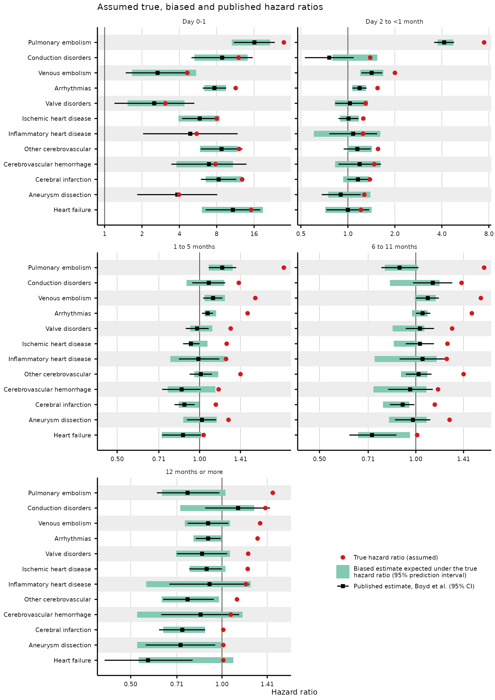
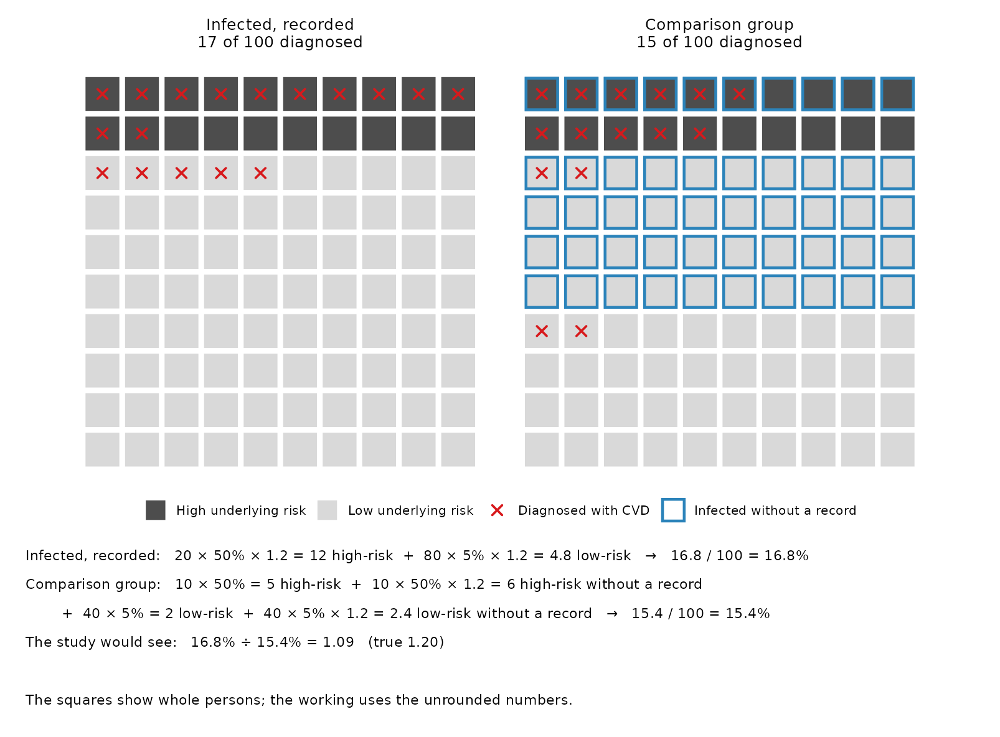
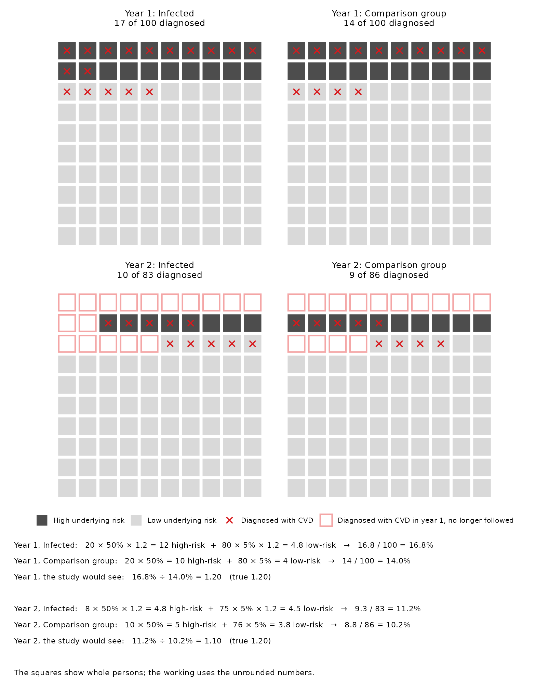
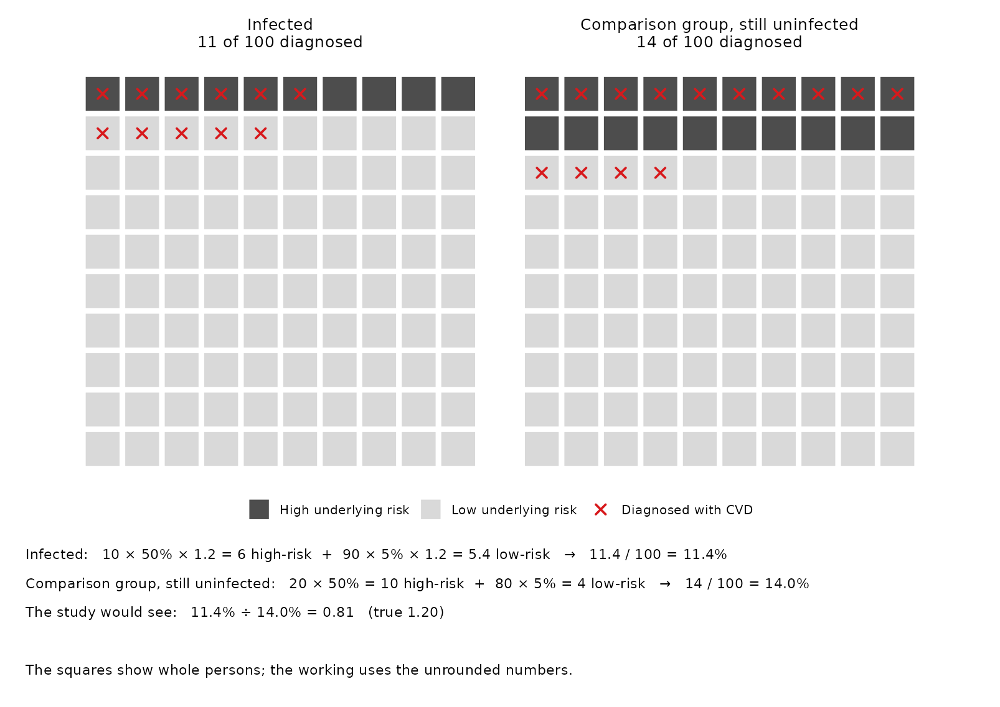
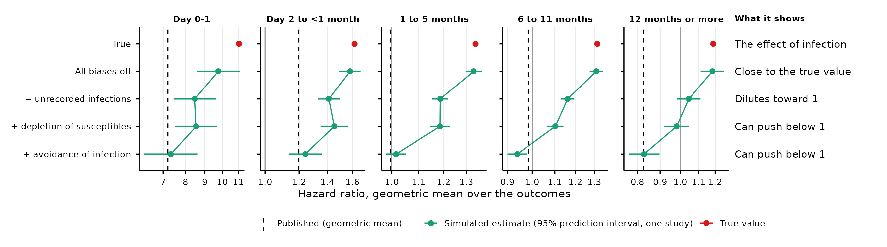
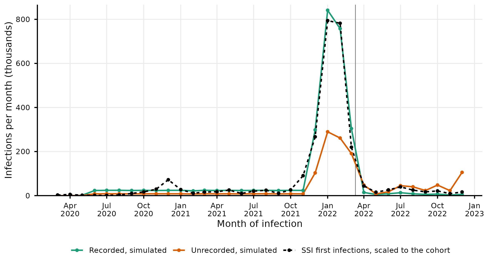
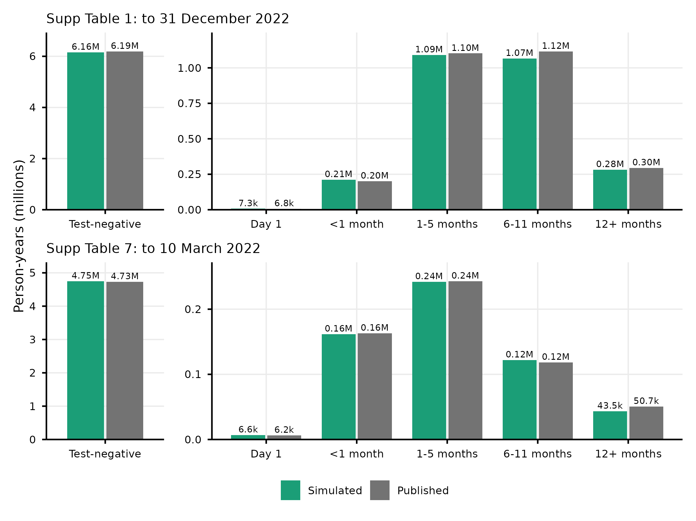
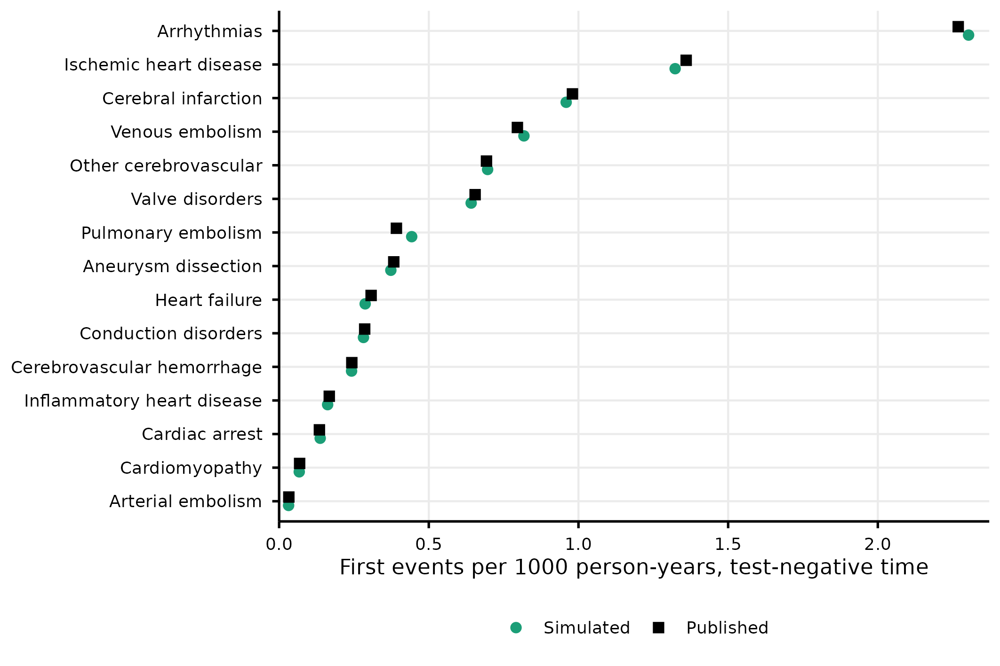

# Long-term cardiovascular risk after SARS-CoV-2 infection: bias in Boyd et al. 2026

## Summary

The European Society of Cardiology (ESC) published a clinical consensus statement on COVID-19 in 2025 (Vassiliou et al., Eur J Prev Cardiol, doi:10.1093/eurjpc/zwaf540). It concludes that cardiovascular complications of COVID-19 can persist for months to years after infection.

Boyd et al. 2026, “SARS-CoV-2 infection and long-term risk of cardiovascular and renal morbidity” (EHJ Open, doi:10.1093/ehjopen/oeag121), report little long-term cardiovascular risk after infection. They followed 4,508,489 Danish persons with a SARS-CoV-2 test. At 12 months or more after a positive test, 14 of their 15 hazard ratios are below 1, and seven are significantly below 1. For heart failure the hazard ratio is 0.57 (95% CI 0.41 to 0.80). Read as causal, infection would protect against cardiovascular disease, which is implausible.

The paper’s own estimates suggest bias. Follow-up ended on 31 December 2022, so the estimates at 12 months or more come only from persons infected in 2020 or 2021. In their first year of follow-up, these persons showed no lower risk (Supplementary Table 5). From 12 months, the published average is 0.82. An effect that becomes protective only after a year is implausible. A comparison group that becomes riskier during 2022 can explain both results.

Three biases can cause this:

- **Unrecorded infections.** Many infections in the Omicron wave had no positive test, and widespread testing ended on 10 March 2022. Infected persons who stay in the comparison group raise its risk, and this dilutes the estimates toward 1.
- **Depletion of susceptibles.** The paper cannot adjust for smoking, body mass index, socioeconomic position or medication use. These cause large differences in cardiovascular risk between persons of the same age. Infection brings diagnoses forward, most of all in persons at high risk. So the infected persons still undiagnosed after a year are at lower risk than the comparison group.
- **Avoidance of infection.** By 2022 most of the population had been infected. If persons at high risk took more care to avoid infection, they made up a growing share of those never infected.

The last two biases can take an estimate below 1.

To test whether these biases can explain the published estimates, I simulated 100 cohorts. Each matches the size, age distribution, outcome rates and person-time of the paper. Infection increased the risk of every outcome in every time window. Every true hazard ratio was at least 1.01, and none increased with time since infection. People with twice the cardiovascular risk of others the same age had a 3.3% lower chance of SARS-CoV-2 infection.

Over all time windows, 58 published hazard ratios had a prediction interval. Of them, 56 (97%) lay within the 95% prediction interval of a single simulated study. At 12 months or more, all 12 did. In this window, the true hazard ratios had an average of 1.19. With the biases added in turn, unrecorded infections moved the estimate to 1.05, depletion of susceptibles to 0.98, and avoidance of infection to 0.83. The paper published 0.82.

At 12 months or more, the published hazard ratios for pulmonary embolism, venous embolism, arrhythmias and heart failure were 0.77, 0.90, 0.90 and 0.57. The true hazard ratios were 1.47, 1.34, 1.31 and 1.01.

In the simulation, SARS-CoV-2 infection caused about 1 in 11 cardiovascular diagnoses: 137 persons per 100,000, compared with the same cohorts without infection.

The simulation shows that the study design can give the published estimates even when infection increases long-term cardiovascular risk. The published estimates therefore cannot rule out the long-term risk that the ESC statement describes.

## Terms

| Term | Meaning |
|----|----|
| Time window | Time since the first positive test: day 0-1, day 2 to \<1 month, 1 to 5 months, 6 to 11 months, or 12 months or more. |
| Recorded infection | An infection with a positive test. |
| Unrecorded infection | An infection without a positive test. The person stays in the comparison group. |
| Comparison group | Persons whose tests have all been negative so far. The paper calls it test-negative person-time. |
| Underlying cardiovascular risk | A person’s cardiovascular risk relative to others of the same age, for example from smoking, body weight or medication. The paper cannot adjust for it. |
| True hazard ratio | In the simulation, the factor by which infection multiplies a person’s hazard of a cardiovascular diagnosis. |
| Average | The geometric mean over the 12 most common outcomes. At day 0-1 it is over the 6 outcomes with an estimate in every simulated cohort. |
| Prediction interval of a single simulated study | The range in which 95% of estimates from one study of this size would fall, from the spread over the 100 simulated cohorts. |
| Omicron wave | 21 December 2021 to 10 March 2022. Widespread PCR testing in Denmark ended on 10 March 2022. |
| Supplementary Tables 1, 5 and 7 | Boyd et al.’s estimates by time window (Table 1), by virus variant (Table 5), and with follow-up ended on 10 March 2022 (Table 7). |

## What the published estimates show

- **By variant (Supplementary Table 5):** for months 1 to 12 of follow-up, the published average over the 12 outcomes is 0.97 for omicron. For the original strain, alpha and delta it is 1.00, 1.02 and 1.05.
- **With follow-up ended on 10 March 2022 (Supplementary Table 7):** for months 1 to 5, the geometric mean of the 15 hazard ratios increases from 0.97 to 1.10.

Persons infected in 2020 and 2021 show no lower risk in their first year of follow-up. If they were healthier from the start, their first-year estimates would also be below 1.

## How the simulation works

1.  **Cohort.** For each of the 100 seeds, `Run.R` simulates a main cohort of 4,508,489 persons. Each main cohort has the paper’s age distribution and follow-up from 1 March 2020 to 31 December 2022. In all, `Run.R` simulates 6 cohorts per seed. They are the main cohort, the same cohort without infection, 3 cohorts for the bias steps, and the main cohort without deaths caused by infection.
2.  **Infections.** 2,698,261 persons get a recorded infection, as in the paper, timed by the Danish case counts. One third of all infections are unrecorded.
3.  **True effects.** Each infection multiplies the hazard of each of 15 cardiovascular outcomes by a true hazard ratio for each time window. Every true hazard ratio is at least 1.01.
4.  **Biases.** Unrecorded infections, depletion of susceptibles and avoidance of infection are built in. The model also lets infection kill some persons. This changes the estimates by 3.4% or less, so it is not treated as a bias.
5.  **Analysis.** Each main cohort is analysed approximately as the paper does. There is one Poisson model per outcome, with person-time split by time window, 5-year age band and calendar year.

For each of the 12 most common outcomes and each time window, I fitted a true hazard ratio to the published estimate. [The model](#the-model) gives every input and its source.

## Results

### By time window (Supplementary Table 1)

At 12 months or more, every true hazard ratio is at least 1.01, and the average is 1.19. 11 of the 12 published estimates are below 1.

Red dot: true hazard ratio. Green band: 95% prediction interval of a single simulated study. Black square and bar: published estimate and 95% CI.

| Time window        | Simulated average | Published average |
|--------------------|------------------:|------------------:|
| Day 0-1            |              7.33 |              7.20 |
| Day 2 to \<1 month |              1.24 |              1.20 |
| 1 to 5 months      |              1.02 |              1.00 |
| 6 to 11 months     |              0.94 |              0.98 |
| 12 months or more  |              0.83 |              0.82 |

- **Outside the prediction interval:** conduction disorders at day 2 to \<1 month and ischemic heart disease at 6 to 11 months.
- **No interval:** aneurysm dissection at day 0-1 and inflammatory heart disease at day 0-1, because too few cohorts had 5 or more events. At day 0-1, the averages are over the 6 outcomes with an estimate in every simulated cohort.
- **95% CI below 1 at 12 months or more:** 4.5 of the 12 outcomes per simulated study, against 6 published.

For several outcomes the published estimate at 6 to 11 months is higher than at 1 to 5 months. The true hazard ratios cannot increase with time, so the fit gives both windows the same value. The appendix gives the [values per outcome](#appendix-values-per-outcome).

### By variant (Supplementary Table 5)

`Run.R` analyses the main cohorts as Supplementary Table 5 does: months 1 to 12 of follow-up, by the variant period of the positive test.

| Variant  | Simulated average | Published average | Outcomes |
|:---------|------------------:|------------------:|---------:|
| Original |              1.07 |              0.97 |       11 |
| Alpha    |              1.03 |              1.00 |       10 |
| Delta    |              0.99 |              1.01 |       10 |
| Omicron  |              0.95 |              0.97 |       12 |

Each average is over the outcomes with an estimate in every simulated cohort, the last column, and the published average is over the same outcomes. The simulation reproduces the pattern: about 1 before the Omicron wave, and lower for omicron. Over these outcomes, omicron against the earlier variants gives 0.93 in the simulation and 0.98 in the paper.

## The three biases

At 12 months or more, the bias-step cohorts add the three biases one at a time. This takes the estimate from the true value to the published one:

| Step                         | Estimate | What it shows           |
|------------------------------|---------:|-------------------------|
| True                         |     1.19 |                         |
| All biases off               |     1.18 | Close to the true value |
| \+ unrecorded infections     |     1.05 | Diluted toward 1        |
| \+ depletion of susceptibles |     0.98 | Pushed below 1          |
| \+ avoidance of infection    |     0.83 | Published: 0.82         |

In the simulation, unrecorded infections bring the estimate toward 1 but not below it.

Each bias below has an example with 100 persons per group. In each example, infection multiplies every person’s risk by 1.20, so the true ratio is 1.20. A high-risk person has a 50% risk and a low-risk person a 5% risk. After each example, the text gives what the bias does in the simulation at 12 months or more. The biases are added one at a time, in this order.

### Unrecorded infections

About one third of infections in the Omicron wave were not recorded, so some infected persons stay in the comparison group and raise its risk. In the example, 50 of 150 infections are unrecorded, and the study sees 1.09.

In the simulation, unrecorded infections lower the estimate from 1.18 to 1.05.

### Depletion of susceptibles

Infection brings diagnoses forward, most of all in high-risk persons. A person diagnosed is no longer followed. So after a year, the infected group has fewer high-risk persons left than the comparison group. In the example, year 1 shows the true ratio, and year 2 shows 1.10. The paper also stops follow-up for every outcome at the first diagnosis of any of the 15 outcomes, which adds to the effect.

In the simulation, depletion of susceptibles lowers the estimate from 1.05 to 0.98. Depletion of susceptibles needs time to act. Before 6 months it changes the estimates little, and from 6 months on it lowers them. The table gives the simulated average without and with depletion of susceptibles, with unrecorded infections in both:

| Time window | Without depletion of susceptibles | With depletion of susceptibles |
|:---|---:|---:|
| Day 0-1 | 8.47 | 8.54 |
| Day 2 to \<1 month | 1.41 | 1.45 |
| 1 to 5 months | 1.19 | 1.18 |
| 6 to 11 months | 1.16 | 1.10 |
| 12 months or more | 1.05 | 0.98 |

### Avoidance of infection

If persons at high underlying cardiovascular risk are more careful, fewer of them are infected. By 2022, when most of the population had been infected, the persons still uninfected include a larger share of high-risk persons. The comparison group then looks riskier than the infected group. In the example, the study sees 0.81.

In the simulation, avoidance of infection lowers the estimate from 0.98 to 0.83. This is the largest bias.

The effect per person is small: a 3.3% lower chance of infection per doubling of underlying cardiovascular risk. The total effect is large because almost everyone was infected, so the comparison group became the persons who avoided infection. In the simulation, the comparison group had a higher average underlying cardiovascular risk than infected persons. It was 15% higher in 2020 and 28% higher in late 2022.

In the paper, 83% of the person-time at 12 months or more lies after 10 March 2022. So these estimates are made against the comparison group of 2022.

### All three together

`Run.R` switches the biases on one at a time in the bias-step cohorts, with the true hazard ratios unchanged.

Each point is the simulated average, with its 95% prediction interval of a single simulated study. At day 0-1, 6 outcomes have an estimate in every cohort. The order of the steps changes the size of each step, but not the first or last point.

| Step | Day 0-1 | Day 2 to \<1 month | 1 to 5 months | 6 to 11 months | 12 months or more |
|:---|---:|---:|---:|---:|---:|
| True | 11.05 | 1.62 | 1.34 | 1.32 | 1.19 |
| All biases off | 9.76 | 1.58 | 1.33 | 1.31 | 1.18 |
| \+ unrecorded infections | 8.47 | 1.41 | 1.19 | 1.16 | 1.05 |
| \+ depletion of susceptibles | 8.54 | 1.45 | 1.18 | 1.10 | 0.98 |
| \+ avoidance of infection | 7.33 | 1.24 | 1.02 | 0.94 | 0.83 |
| Published | 7.20 | 1.20 | 1.00 | 0.98 | 0.82 |

In the first month, the estimate with all biases off is already below the true value. The paper starts follow-up 30 days after the first test. For a person whose first test was positive, these windows therefore lie about a month after infection.

## Extra diagnoses

`Run.R` also simulates each main cohort without infection, with everything else the same. Infection adds 6,169 persons with a cardiovascular diagnosis per cohort, the mean over the 100 cohorts. That is 137 per 100,000 persons. It is about 1 in 11 of the 69,053 persons with a first cardiovascular diagnosis in the main cohort of seed 1. Of the extra persons, 3,738 have a recorded infection and 2,432 an unrecorded one.

In the 12 months after a recorded infection, the risk of a first cardiovascular diagnosis is 0.580% with infection and 0.436% without. The base is the 665,928 persons per cohort followed for at least 12 months after a recorded infection.

[figures/forest_12m.png](figures/forest_12m.png) is Figure 1 of the letter. It shows the window of 12 months or more. Its right column gives the extra diagnoses per 100,000 persons with a recorded infection over 0-24 months, computed without deaths caused by infection. The base is the 101,291 persons per cohort followed for 24 months after a recorded infection.

## Assumptions

The simulation only has to show that a cohort in which infection is harmful can give the published estimates. The true hazard ratios and the size of each bias do not need to be exact.

- **The true hazard ratios are fitted** to the published estimates. The table under [All three together](#all-three-together) gives their average per time window.
- **Avoidance of infection is assumed.** No source measures it in Denmark. Its strength was chosen to reproduce the omicron against pre-Omicron contrast of Supplementary Table 5. Any other mechanism that makes the comparison group riskier in 2022 acts in the same way.
- **How much underlying cardiovascular risk varies is assumed.** At the same age, the 95th percentile is 227.7 times the 5th. It stands for the risk left after the paper’s adjustment for age, sex and comorbidity.
- **One third of infections are unrecorded.** Erikstrup et al. 2022 measured this in blood donors aged 17-72 during the Omicron wave. The model applies it to all ages and the whole period.
- **The timing of unrecorded infections and the death hazards are assumed.**
- **The analysis approximates the paper’s Cox model.** The paper uses age as the time scale and adjusts for sex and comorbidity. The simulation uses 5-year age bands, within which the hazard still rises 1.59-fold, and has no sex or comorbidity.
- **The national case counts are applied to the cohort.** They include reinfections.

Not in the simulation:

- **Washout:** the paper starts follow-up 30 days after the first test, so for a positive first test the acute phase is left out.
- **Testing at hospital contact:** a person admitted with a cardiovascular event is tested on arrival. The paper names this as the likely cause of its day 0-1 results.
- **Vaccination and variant severity:** infections in 2020 and early 2021 came before most vaccination, and were on average more severe.
- **Reinfections:** the simulation has first infections only.
- **Delayed or caught-up diagnoses in 2020 and 2021.**

## The model

The table gives every input and its source. The name in brackets is the setting in `Run.R`.

| Component | How `Run.R` draws it | Source |
|----|----|----|
| Age | Age at the start of follow-up, from a monotone spline. Its knots are the median 34.2, the quartiles 18.5 and 52.3, and the Table 1 band edges at 40 and 65 years. Above the last band, the knots are 72 years (95th percentile), 97 (99.9th) and 105. | Paper, Results and Table 1. The knots above 65 years are assumed. |
| Follow-up | Start of follow-up, from a monotone spline. Day 1036 is 31 December 2022, the end of follow-up, so the quartiles of the start day are day 1036 minus the paper’s follow-up quartiles. Its 95th percentile is day 759.7, and its maximum is day 1035. Follow-up stops at the first cardiovascular diagnosis, death or 31 December 2022. | Paper, Results, for the quartiles. The 95th percentile is fitted to the person-years of Supplementary Tables 1 and 7. |
| Underlying cardiovascular risk (`fsd`) | One log-normal multiplier per person, SD 1.65 on the log scale, mean 1. It multiplies all 15 cardiovascular hazards, the death hazard and the probability of death caused by infection. | Assumed. |
| Outcomes | 15 cardiovascular groups. Each hazard is Gompertz in age, doubling every 7.5 years, times the underlying cardiovascular risk, times one common scale (`sc`). The level of each outcome is its rate in the comparison group in Supplementary Table 1. The scale is fitted with the true hazard ratios, so that the first-event rate in the comparison group is 8.766 per 1000 person-years. | Supplementary Table 1: 54,247 events in 6,188,401 person-years in the comparison group. The age slope is assumed. |
| Recorded infection (`p_infected`) | 2,698,261 of 4,508,489 persons (59.8%). Persons are drawn with a weight: the SSI confirmed cases per resident of the person’s age group, times the avoidance factor. The probability of being drawn is proportional to the weight, and at most 1. The date is piecewise uniform: 16.4% to 21 December 2021, the Omicron wave to 10 March 2022, and 3.9% after, split by month. | Paper, Results. SSI cases by age group and first infections by month, in `data/ssi/`. The dates to 10 March 2022 are fitted with the start of follow-up. |
| Unrecorded infection (`contam`) | 74.5% of persons without a recorded infection get an unrecorded one, so one third of all infections are unrecorded. They follow the same age pattern and avoidance factor. Their dates follow the recorded curve, weighted by (1 - p)/p. The timing weight p is 0.40 to 10 March 2022 and 0.05 after. Dates after 10 March 2022 follow the weekly SSI wastewater index. | Erikstrup et al. 2022 for the one third. SSI wastewater index in `data/ssi/`. The timing weights are assumed. |
| Avoidance of infection (`avoid`) | A person’s weight in the draws of recorded and unrecorded infections is multiplied by exp(-0.08 z). Here z is the person’s log underlying cardiovascular risk in SD units. Twice the underlying cardiovascular risk gives a 3.3% lower weight. An infection that moves to another person does not use the factor. A recorded infection moves when its first person died before it. An unrecorded one also moves when its first person already has a recorded infection. This moves 0.25% of recorded and 0.80% of unrecorded infections. | Assumed. Chosen to reproduce the omicron against pre-Omicron contrast of Supplementary Table 5. |
| Effect of infection (`tm`) | Five true hazard ratios per outcome, one per time window. Recorded and unrecorded infections carry them alike. Arterial embolism, cardiac arrest and cardiomyopathy have the 3 lowest rates and are not among the 12 fitted outcomes. Their true hazard ratios are the geometric mean of the 12 fitted ones, per window. | Fitted so that the simulated estimates of the 12 outcomes reproduce Supplementary Table 1. |
| Death | Gompertz in age: 0.8 per 1000 person-years at the median age, doubling every 8 years, times the underlying cardiovascular risk. Only a living person is infected. An infection during follow-up kills with probability 0.03 at age 80 and average underlying cardiovascular risk (`p80`). The probability is higher at older ages and higher underlying cardiovascular risk. Every person is alive at the start of follow-up, so an earlier infection does not kill. | Assumed. |
| Analysis | Person-time split by time window since the recorded test, 5-year age band and calendar year. Follow-up stops at the first diagnosis of any of the 15 outcomes. One Poisson model per outcome. | Approximates the paper’s Cox model. |

A person’s cardiovascular hazard changes only with age, underlying cardiovascular risk and infection. There is no calendar-time effect.

## How the simulated cohort matches the paper

The table compares the first simulated cohort with the paper and with national data. “Input” marks a quantity the model is set or fitted to. “Check” marks one that no input sets.

| Quantity | Simulated | Published | Source | Role |
|:---|:---|:---|:---|:---|
| Persons | 4,508,489 | 4,508,489 | Paper, Results | input |
| Age, median (IQR), years | 34.2 (18.5-52.3) | 34.2 (18.5-52.3) | Paper, Results | input |
| Age at first test \<40 / 40-64 / 65+ | 57.7% / 32.2% / 10.1% | 57.7% / 32.2% / 10.1% | Paper, Table 1 | input |
| Person-years | 8,815,402 | 8,909,627 | Paper, Results | input |
| Follow-up, median (IQR), months | 25.1 (21.4-27.4) | 25.2 (21.7-27.5) | Paper, Results | input |
| Recorded positives | 2,698,261 (59.8%) | 2,698,261 (59.8%) | Paper, Results | input |
| Recorded share by SSI age group | within 1.7 binomial SE of the target in 9 of 9 groups | the age pattern of SSI cases | SSI | input |
| Person-years in the comparison group | 6,156,784 | 6,188,401 | Supplementary Table 1 | input |
| Comparison group, first cardiovascular diagnoses per 1000 person-years, whole period | 8.767 | 8.766 | Supplementary Table 1 | input |
| Same, to 10 March 2022 | 8.073 | 8.119 | Supplementary Table 7 | check |
| Same, after 10 March 2022 | 11.102 | 10.870 | Supplementary Tables 1 and 7 | check |
| Rate per outcome in the comparison group, simulated / published | 0.94 to 1.13 | 1 | Supplementary Table 1 | input |
| Person-years, 12 months or more, to 10 March 2022 | 43,536 | 50,715 | Supplementary Table 7 | input |
| Persons with a first cardiovascular diagnosis | 69,053 | 70,885 | Paper, Results | check |
| … after a recorded positive | 15,079 | 16,475 | Paper, Results | check |
| Recorded infections in 2020 / 2021 / 2022 | 6.2% / 20.6% / 73.2% | 5.3% / 20.2% / 74.5% | SSI first infections | check |
| Infected, 1 November 2021 to 15 March 2022 | 66.2% of all persons | 66% (63-70%) of all blood donors aged 17-72 | Erikstrup et al. 2022 | check |
| Unrecorded share of those infections | 26.3% | one third | Erikstrup et al. 2022 | check |

The SSI line is the national count of first infections, scaled to the paper’s 2,698,261 recorded positives, so it compares timing only. The grey line marks 10 March 2022, when widespread testing ended.

The figures call the comparison group “test-negative”, as the paper does. The cohort agrees closely with the paper. The larger differences are:

- **Recorded infections after 10 March 2022.** The model puts 3.9% of recorded infections after that day, fitted to the paper’s person-years rather than to SSI. From April to December 2022 it has 0.33 times the scaled SSI count, and in March 2022 1.38 times.

- **Recorded infections before the Omicron wave** are spread evenly, so the 2020 and 2021 waves are absent. The share per calendar year still agrees with SSI.

- **Person-years at 12 months or more to 10 March 2022:** 0.86 times the published value in Supplementary Table 7.

- **Persons with a first cardiovascular diagnosis after a recorded positive:** 15,079, against 16,475.

- **Unrecorded share in the Erikstrup window:** 26.3%, because the model moves unrecorded infections later. Erikstrup et al. studied blood donors aged 17-72, and a donor can seroconvert on a reinfection.

## Appendix: values per outcome

The values in the figure of [By time window](#by-time-window-supplementary-table-1), in its order. The last column is the extra rate of first diagnoses caused by infection, per 100,000 person-years, among persons with a recorded infection. Each person is simulated with and without infection, and both are computed without deaths caused by infection. It is the mean over the 100 cohorts. Where the true hazard ratio is 1.01, it can fall just below 0. The causes are Monte Carlo error, and earlier diagnoses that leave fewer persons at risk later.

### Pulmonary embolism

| Window | True HR | Simulated 95% PI | Published HR (95% CI) | Extra per 100,000 person-years |
|:---|---:|---:|---:|---:|
| Day 0-1 | 27.79 | 10.58-21.51 | 16.10 (11.00-23.50) | 554.5 |
| Day 2 to \<1 month | 7.46 | 3.75-4.73 | 4.14 (3.57-4.79) | 137.3 |
| 1 to 5 months | 2.03 | 1.08-1.32 | 1.21 (1.08-1.36) | 23.4 |
| 6 to 11 months | 1.63 | 0.80-1.01 | 0.89 (0.78-1.02) | 13.9 |
| 12 months or more | 1.47 | 0.63-1.03 | 0.77 (0.61-0.98) | 10.8 |

### Conduction disorders

| Window | True HR | Simulated 95% PI | Published HR (95% CI) | Extra per 100,000 person-years |
|:---|---:|---:|---:|---:|
| Day 0-1 | 12.01 | 5.28-14.19 | 8.85 (5.01-15.60) | 173.3 |
| Day 2 to \<1 month | 1.39 | 0.79-1.54 | 0.76 (0.53-1.09) | 6.7 |
| 1 to 5 months | 1.39 | 0.90-1.23 | 1.08 (0.94-1.24) | 6.7 |
| 6 to 11 months | 1.39 | 0.83-1.19 | 1.13 (0.98-1.30) | 6.5 |
| 12 months or more | 1.39 | 0.73-1.28 | 1.13 (0.88-1.44) | 6.1 |

### Venous embolism

| Window | True HR | Simulated 95% PI | Published HR (95% CI) | Extra per 100,000 person-years |
|:---|---:|---:|---:|---:|
| Day 0-1 | 4.64 | 1.67-5.47 | 2.67 (1.48-4.84) | 153.7 |
| Day 2 to \<1 month | 2.00 | 1.20-1.69 | 1.42 (1.22-1.66) | 44.8 |
| 1 to 5 months | 1.60 | 1.04-1.24 | 1.12 (1.03-1.21) | 27.3 |
| 6 to 11 months | 1.60 | 0.99-1.15 | 1.09 (1.00-1.18) | 27.3 |
| 12 months or more | 1.34 | 0.75-1.06 | 0.90 (0.77-1.05) | 14.5 |

### Arrhythmias

| Window | True HR | Simulated 95% PI | Published HR (95% CI) | Extra per 100,000 person-years |
|:---|---:|---:|---:|---:|
| Day 0-1 | 11.37 | 6.34-9.54 | 7.67 (6.17-9.53) | 1215.1 |
| Day 2 to \<1 month | 1.55 | 1.07-1.30 | 1.19 (1.07-1.32) | 69.1 |
| 1 to 5 months | 1.50 | 1.04-1.15 | 1.07 (1.02-1.12) | 61.5 |
| 6 to 11 months | 1.50 | 0.97-1.09 | 1.05 (1.00-1.11) | 58.5 |
| 12 months or more | 1.31 | 0.80-1.00 | 0.90 (0.82-0.99) | 33.5 |

### Valve disorders

| Window | True HR | Simulated 95% PI | Published HR (95% CI) | Extra per 100,000 person-years |
|:---|---:|---:|---:|---:|
| Day 0-1 | 3.09 | 1.53-4.41 | 2.51 (1.20-5.28) | 75.3 |
| Day 2 to \<1 month | 1.30 | 0.82-1.35 | 1.03 (0.83-1.28) | 11.5 |
| 1 to 5 months | 1.30 | 0.92-1.11 | 0.98 (0.89-1.08) | 11.8 |
| 6 to 11 months | 1.30 | 0.85-1.06 | 1.03 (0.93-1.14) | 10.7 |
| 12 months or more | 1.22 | 0.71-1.06 | 0.86 (0.71-1.04) | 7.4 |

### Ischemic heart disease

| Window | True HR | Simulated 95% PI | Published HR (95% CI) | Extra per 100,000 person-years |
|:---|---:|---:|---:|---:|
| Day 0-1 | 8.00 | 3.94-8.47 | 5.84 (4.21-8.11) | 500.2 |
| Day 2 to \<1 month | 1.26 | 0.89-1.17 | 1.01 (0.87-1.17) | 20.7 |
| 1 to 5 months | 1.26 | 0.91-1.07 | 0.93 (0.87-1.00) | 19.6 |
| 6 to 11 months | 1.26 | 0.85-1.01 | 1.03 (0.93-1.14) | 18.9 |
| 12 months or more | 1.22 | 0.78-1.03 | 0.89 (0.78-1.00) | 16.4 |

### Inflammatory heart disease

| Window | True HR | Simulated 95% PI | Published HR (95% CI) | Extra per 100,000 person-years |
|:---|---:|---:|---:|---:|
| Day 0-1 | 5.52 | none | 4.90 (2.04-11.80) | 38.4 |
| Day 2 to \<1 month | 1.25 | 0.60-1.61 | 1.08 (0.76-1.54) | 2.6 |
| 1 to 5 months | 1.25 | 0.78-1.24 | 0.99 (0.84-1.18) | 2.6 |
| 6 to 11 months | 1.25 | 0.74-1.16 | 1.05 (0.89-1.23) | 2.4 |
| 12 months or more | 1.20 | 0.56-1.24 | 0.91 (0.67-1.23) | 1.9 |

### Other cerebrovascular

| Window | True HR | Simulated 95% PI | Published HR (95% CI) | Extra per 100,000 person-years |
|:---|---:|---:|---:|---:|
| Day 0-1 | 12.10 | 5.88-11.74 | 8.75 (5.95-12.90) | 404.8 |
| Day 2 to \<1 month | 1.56 | 1.00-1.43 | 1.15 (0.94-1.40) | 22.0 |
| 1 to 5 months | 1.41 | 0.96-1.17 | 1.01 (0.92-1.11) | 16.7 |
| 6 to 11 months | 1.41 | 0.90-1.09 | 1.02 (0.93-1.12) | 15.7 |
| 12 months or more | 1.12 | 0.63-0.98 | 0.77 (0.64-0.94) | 4.2 |

### Cerebrovascular hemorrhage

| Window | True HR | Simulated 95% PI | Published HR (95% CI) | Extra per 100,000 person-years |
|:---|---:|---:|---:|---:|
| Day 0-1 | 7.82 | 3.78-10.82 | 6.93 (3.45-13.90) | 83.7 |
| Day 2 to \<1 month | 1.47 | 0.83-1.61 | 1.19 (0.87-1.63) | 6.6 |
| 1 to 5 months | 1.17 | 0.76-1.14 | 0.86 (0.73-1.01) | 2.4 |
| 6 to 11 months | 1.17 | 0.74-1.08 | 0.96 (0.82-1.13) | 2.7 |
| 12 months or more | 1.07 | 0.53-1.17 | 0.85 (0.63-1.14) | 0.8 |

### Cerebral infarction

| Window | True HR | Simulated 95% PI | Published HR (95% CI) | Extra per 100,000 person-years |
|:---|---:|---:|---:|---:|
| Day 0-1 | 12.83 | 6.53-12.83 | 8.29 (5.97-11.50) | 605.3 |
| Day 2 to \<1 month | 1.38 | 0.93-1.37 | 1.16 (0.99-1.37) | 20.9 |
| 1 to 5 months | 1.15 | 0.84-1.00 | 0.88 (0.81-0.96) | 8.0 |
| 6 to 11 months | 1.15 | 0.79-0.95 | 0.91 (0.83-0.99) | 8.0 |
| 12 months or more | 1.01 | 0.64-0.88 | 0.74 (0.62-0.88) | 0.1 |

### Aneurysm dissection

| Window | True HR | Simulated 95% PI | Published HR (95% CI) | Extra per 100,000 person-years |
|:---|---:|---:|---:|---:|
| Day 0-1 | 3.97 | none | 3.85 (1.83-8.09) | 64.7 |
| Day 2 to \<1 month | 1.28 | 0.75-1.40 | 0.90 (0.68-1.21) | 6.1 |
| 1 to 5 months | 1.28 | 0.87-1.16 | 1.02 (0.90-1.15) | 6.4 |
| 6 to 11 months | 1.28 | 0.82-1.08 | 0.98 (0.86-1.11) | 5.9 |
| 12 months or more | 1.01 | 0.52-1.01 | 0.73 (0.56-0.95) | 0.5 |

### Heart failure

| Window | True HR | Simulated 95% PI | Published HR (95% CI) | Extra per 100,000 person-years |
|:---|---:|---:|---:|---:|
| Day 0-1 | 15.14 | 6.06-18.87 | 10.80 (6.51-18.00) | 227.5 |
| Day 2 to \<1 month | 1.21 | 0.71-1.42 | 1.00 (0.73-1.37) | 3.4 |
| 1 to 5 months | 1.03 | 0.73-1.01 | 0.87 (0.73-1.01) | 0.6 |
| 6 to 11 months | 1.01 | 0.66-0.96 | 0.73 (0.62-0.87) | 0.3 |
| 12 months or more | 1.01 | 0.53-1.09 | 0.57 (0.41-0.80) | 0.1 |

## How to run it

From the repository root, with R 4.6, data.table, ggplot2, patchwork and knitr:

1.  `Rscript Run.R`: the simulation, the biases and the analysis by variant. It simulates 600 cohorts, 6 per seed. Each cohort needs about 11 GiB of memory, and it runs 2 at a time, so it needs at least 25 GB free.
2.  `Rscript Illustrations.R`: the three examples.
3.  `quarto render README.qmd`: this README, from `results/`.

`Run.R` checks the md5 of the SSI files in `data/ssi/`. It stops if a value in its CFG section differs from the file it comes from.

## Layout

| Path | Content |
|----|----|
| `Run.R` | The model settings, the published values with their sources, the simulation, the analysis, the biases and the output. |
| `Illustrations.R` | The three examples with 100 persons per group. |
| `README.qmd` | The source of this README. |
| `data/ssi/` | The SSI source files, byte for byte, with their sources and md5s. |
| `figures/` | The figures that `Run.R` and `Illustrations.R` draw. |
| `results/` | The results that the two scripts save and `README.qmd` reads. |

## Licence

The code and figures are under the MIT licence. See `LICENSE`. The MIT licence does not cover the SSI files in `data/ssi/`: they are © Copyright Statens Serum Institut.
