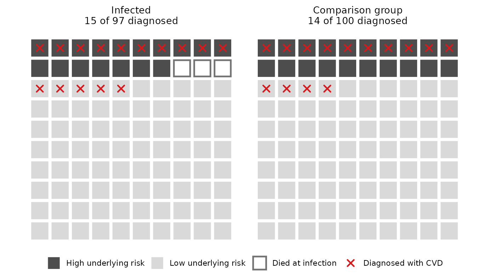
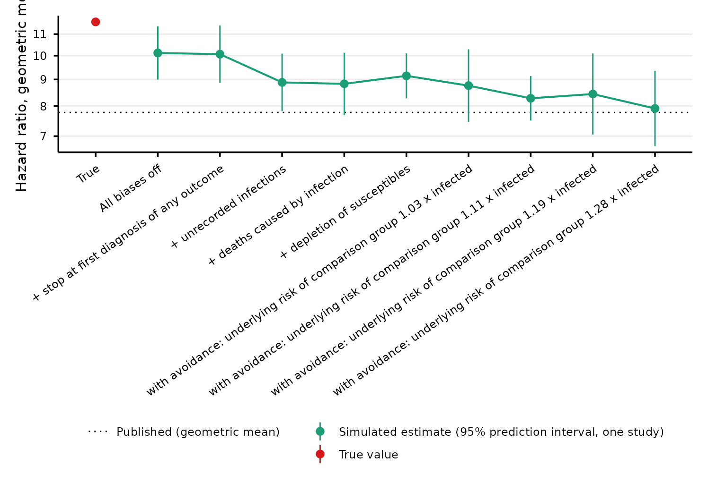
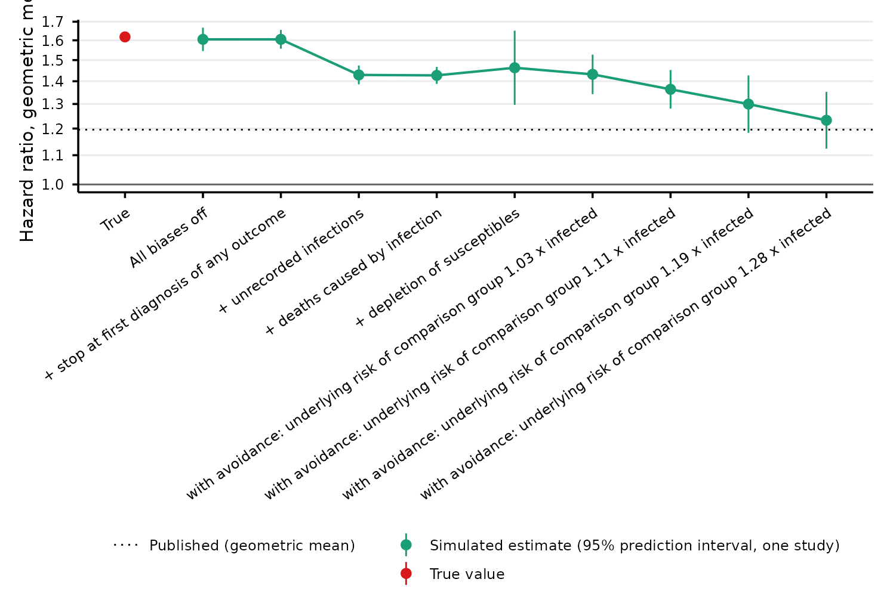
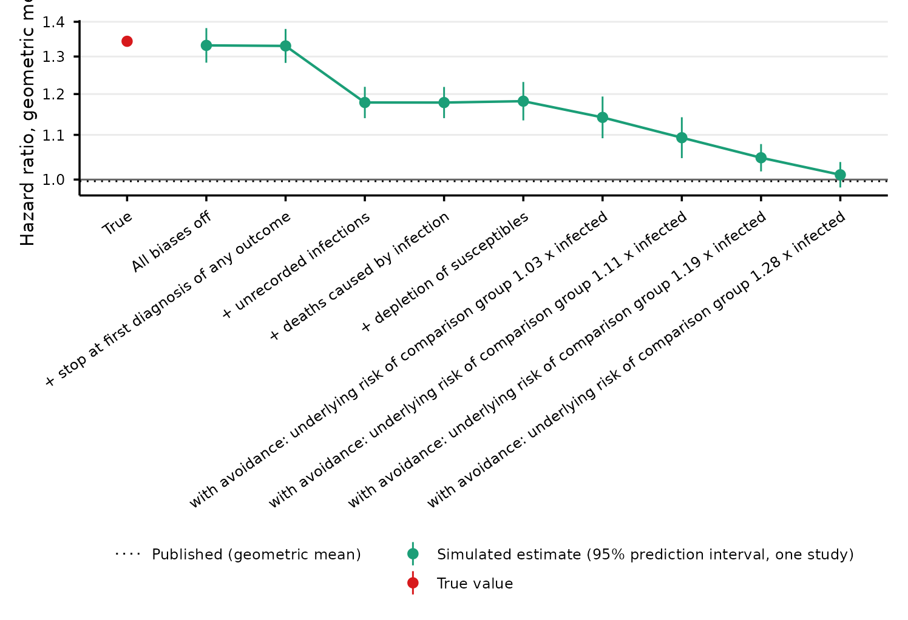
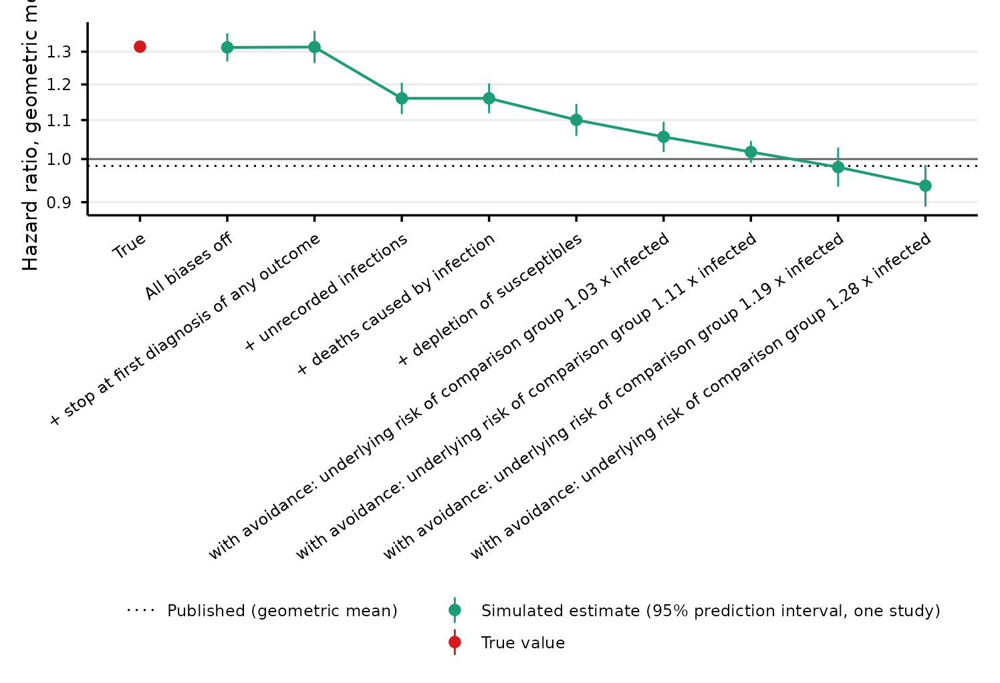
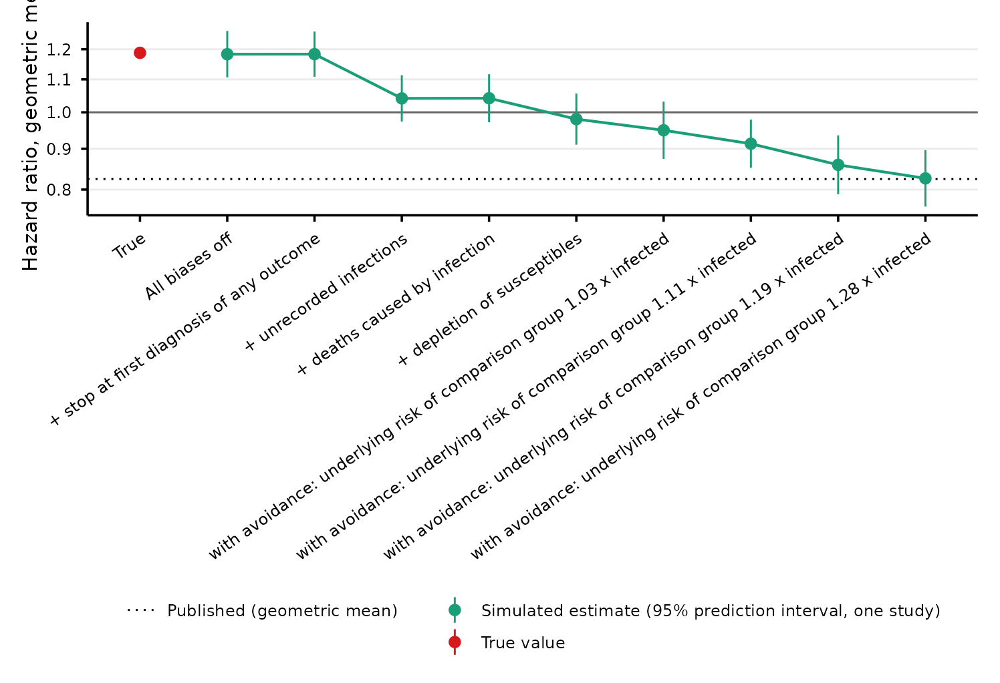

# Long-term cardiovascular risk after SARS-CoV-2 infection: bias in Boyd et al. 2026

## What this repository shows

Boyd et al. 2026, “SARS-CoV-2 infection and long-term risk of cardiovascular and renal morbidity” (EHJ Open, doi:10.1093/ehjopen/oeag121), followed 4.5 million Danish persons with a SARS-CoV-2 test. At 12 months or more after a positive test, 11 of the 12 most common cardiovascular outcomes have a hazard ratio below 1, and 6 have a 95% CI below 1. The authors conclude that infection carries little long-term cardiovascular risk.

**The published estimates do not support that conclusion.** We simulated a cohort in which infection increases the risk of every cardiovascular outcome in every time window. At 12 months or more, the true hazard ratios have a geometric mean of 1.19 over the 12 outcomes. Analysed as the paper does, the simulated cohort gives a geometric mean of 0.83, against 0.82 published. 57 of the 59 published estimates with a prediction interval lie inside it. The simulation also reproduces the published estimates by virus variant. A design that reports a harmful effect as a protective one cannot be used to rule out harm.

The main cause is the comparison group. By the end of 2022, 90% of the cohort had been infected. The persons still in the comparison group were at higher underlying cardiovascular risk, because higher-risk persons were slightly more likely to avoid infection. The comparison group also held persons infected without a positive test. In the paper, 83% of the person-time at 12 months or more lies after 10 March 2022, so these estimates are made against this comparison group.

## Terms used here

| Term | Meaning |
|----|----|
| True hazard ratio | In the simulation, the factor by which infection multiplies a person’s hazard of a cardiovascular diagnosis, for a person of given age and underlying risk. It is set by the model, so it is known. |
| Estimated hazard ratio | What the paper’s analysis gives when it is applied to a simulated cohort. |
| Published hazard ratio | The estimate in Boyd et al. |
| Time window | Time since the first positive test. The paper uses five: day 0-1, day 2 to \<1 month, 1 to 5 months, 6 to 11 months, and 12 months or more. Every hazard ratio belongs to one window. |
| Recorded infection | An infection with a positive test in the Danish registers. |
| Unrecorded infection | An infection without a positive test. The person stays in the comparison group. |
| Comparison group | Person-time of persons whose tests have all been negative so far. The paper calls it test-negative person-time. A person leaves it at their first positive test. |
| Underlying cardiovascular risk | The part of a person’s cardiovascular risk that age does not explain, for example from smoking, body weight or medication. The paper does not adjust for these. In the code it is called frailty: one number per person that multiplies all of that person’s cardiovascular hazards. |
| Avoidance of infection | Persons with a higher underlying cardiovascular risk are less likely to be infected. They are then more common among those still uninfected, so the comparison group gets riskier as the population is infected. |
| Depletion of susceptibles | Infection brings diagnoses forward, most of all in persons at high underlying risk. Those still undiagnosed later are then at lower risk than at the start. |
| Prediction interval | The range in which 95% of estimates from one study of this size would fall, from the spread over the 10 simulated cohorts. |
| Omicron wave | 21 December 2021 to 10 March 2022 in the model. Widespread PCR testing in Denmark ended on 10 March 2022. |
| Supplementary Table 1 | Boyd et al.’s main estimates: hazard ratio per outcome and time window. |
| Supplementary Table 5 | Boyd et al.’s hazard ratios for 1 to 12 months after infection, separately for the original strain, alpha, delta and omicron. |
| Supplementary Table 7 | Boyd et al.’s sensitivity analysis that ends follow-up on 10 March 2022. |

## The two published patterns the model must reproduce

**Supplementary Table 1, estimates by time window.** Over the 12 most common outcomes, the geometric mean of the published hazard ratios is 1.00 at 1 to 5 months, 0.98 at 6 to 11 months and 0.82 at 12 months or more. At 12 months or more, 6 of the 12 have a 95% CI below 1. Follow-up ended on 31 December 2022, so the window of 12 months or more holds only persons infected in 2020 and 2021.

**Supplementary Table 5, estimates by variant.** For persons infected before the Omicron wave, the geometric mean over the 12 outcomes for 1 to 12 months is 1.00 (original strain), 1.02 (alpha), 1.05 (delta). For omicron it is 0.97.

The two patterns point to bias, not protection. The persons infected in 2020 and 2021 show no lower risk in their first year after infection. Their estimates fall below 1 only later, in 2022. A protective effect that starts only after a year is implausible. If persons infected early were at lower underlying risk from the start, their first-year estimates would be lower too. A comparison group that becomes riskier in 2022 gives both patterns, because the window of 12 months or more and the omicron estimates are the ones measured against it.

## How the simulation works

1.  **Cohort.** `Run.R` simulates 10 cohorts of 4,508,489 persons, the size of the paper’s cardiovascular cohort, with its age distribution and follow-up from 1 March 2020 to 31 December 2022.
2.  **Infections.** 2,698,261 persons get a recorded infection, as in the paper, at dates that follow the Danish national case counts. One third of all infections are unrecorded. Persons with a higher underlying cardiovascular risk are less likely to be infected (avoidance of infection).
3.  **True effects.** Each infection, recorded or unrecorded, multiplies the person’s hazard of each of 15 cardiovascular outcomes by a true hazard ratio for each time window. Every true hazard ratio is at least 1.01, so infection is harmful for every outcome in every window.
4.  **Biases.** Five features of the data can move the estimates away from the true hazard ratios: depletion of susceptibles, avoidance of infection, unrecorded infections, deaths caused by infection, and the end of follow-up at a person’s first diagnosis of any of the 15 outcomes.
5.  **Analysis.** Each cohort is analysed as the paper does, approximately: person-time is split by time window, 5-year age band and calendar year, and one Poisson model per outcome gives the estimated hazard ratios.

The true hazard ratios are fitted: they are the values for which the estimated hazard ratios match the published ones, under the rule that a true hazard ratio is at least 1.01 and does not increase with time since infection. [The model](#the-model) gives every input and its source.

## Result

### Supplementary Table 1: estimates by time window

At 12 months or more, the true hazard ratio is at least 1.01 for every outcome, and its geometric mean over the 12 outcomes is 1.19. The published estimates are below 1 for 11 of the 12. Over all windows, 57 of the 59 published estimates with an interval (97%) lie inside the 95% prediction interval of the simulated estimates. Each interval is for one estimate on its own.

Each row is one of the 12 cardiovascular outcomes with the highest rate in the comparison group. Each panel is a time window.

- **Red dot:** the true hazard ratio.
- **Green band:** the 95% prediction interval for the estimate of one study. A cohort has an estimate only if the window has at least 5 events, and a band needs estimates from at least 6 cohorts.
- **Black square and bar:** the published estimate and its 95% CI, from Supplementary Table 1.

Agreement with the published estimates:

- **Outside the prediction interval:** aneurysm dissection at day 2 to \<1 month and ischemic heart disease at 6 to 11 months.
- **Without an interval:** inflammatory heart disease at day 0-1, because fewer than 6 cohorts had 5 or more events.
- **Geometric mean of the 12 outcomes, simulated against published:** 1.23 against 1.20 at day 2 to \<1 month; 1.01 against 1.00 at 1 to 5 months; 0.94 against 0.98 at 6 to 11 months; 0.83 against 0.82 at 12 months or more. Day 0-1 is left out, because some outcomes have no estimate in some simulated cohorts.
- **At 12 months or more,** a mean of 4.4 of the 12 outcomes per simulated cohort have a 95% CI below 1, against 6 published.

The true hazard ratios do not increase with time since infection. For several outcomes the published estimate at 6 to 11 months is higher than at 1 to 5 months. The fit then gives both windows the same true value, and the simulated estimate lies above the published one at 1 to 5 months and below it at 6 to 11 months.

The values per outcome are in the [appendix](#appendix-values-per-outcome).

### Supplementary Table 5: estimates by variant

`Bias.R` analyses the simulated cohorts as the paper’s Supplementary Table 5 does: the hazard ratio for 1 to 12 months, by the variant period of the positive test.

| Variant  | Simulated | Published | Outcomes |
|:---------|----------:|----------:|---------:|
| Original |      1.04 |      1.00 |       12 |
| Alpha    |      1.01 |      1.02 |       12 |
| Delta    |      0.98 |      1.03 |       11 |
| Omicron  |      0.95 |      0.97 |       12 |

Each value is the geometric mean over the outcomes with an estimate in every simulated cohort, and the published value is over the same outcomes. Omicron against the three earlier variants, the simulation gives 0.94 and the paper 0.96. The simulation reproduces the published pattern: in the first year, the estimates after an infection before the Omicron wave lie around 1, and those after an omicron infection are lower. The largest difference is for delta, 0.98 against 1.03 published.

### Extra diagnoses

`Run.R` simulates each cohort a second time without infection. The persons, their natural death times and their event thresholds stay the same. With infection, a mean of 6,181 more persons per cohort have a cardiovascular diagnosis. That is 137.1 per 100,000 persons, or 8.7% of the 70,885 persons with a cardiovascular diagnosis in the paper. Of them, 3,738 have a recorded infection and 2,443 an unrecorded one.

In the 12 months after a recorded infection, the risk of a first cardiovascular diagnosis is 0.586% with infection and 0.439% without. The base is the 665,704 persons per cohort with a recorded infection whose follow-up runs at least 12 months past it.

The letter figure is [figures/forest_12m.png](figures/forest_12m.png). It shows the window of 12 months or more, with the outcomes sorted by the published hazard ratio. Its right column gives the cumulative extra diagnoses per 100,000 persons over the 24 months after a recorded infection. Its base is the 101,299 persons per cohort whose follow-up runs that long.

## Why the estimates fall below 1

### How each bias works

The four examples use 100 persons per group, and illustrative numbers rather than simulation output. In each, infection multiplies every person’s risk of a cardiovascular diagnosis by 1.20. A high-risk person has a 50% risk and a low-risk person a 5% risk. So the true ratio of risks is 1.20 in every example. Each example gives the ratio that a study would see. `Illustrations.R` draws them.

After each example comes the size of the bias in the simulation: how the estimate at 12 months or more changes when the bias is added. The biases are added in the order of the figures in [the next section](#what-each-bias-does-in-the-simulation), and each value is the geometric mean over the 12 outcomes.

**Higher-risk persons avoid infection.** If persons at high underlying risk are more careful, fewer of them are infected. By 2022, when most of the population had been infected, those still uninfected include a larger share of high-risk persons. The comparison group then looks riskier than the infected group, for a reason that has nothing to do with infection. The study would see 0.81.

In the simulation, avoidance of infection lowers the estimate from 0.98 to 0.83. It is the largest bias.

**Depletion of susceptibles.** Both groups start with the same 100 persons, followed for two years. A person diagnosed in year 1 is no longer free of cardiovascular disease, so they leave the comparison. Infection brings diagnoses forward, most of all in high-risk persons, so in year 2 the infected group has fewer high-risk persons left. Year 1 shows the true ratio, and year 2 shows 1.10.

In the simulation, depletion of susceptibles lowers the estimate from 1.04 to 0.98. Adding it also lets deaths caused by infection fall on the persons at highest risk. The effect grows with time since infection, as depletion does:

| Time window       | Before | After |
|:------------------|-------:|------:|
| 1 to 5 months     |   1.18 |  1.18 |
| 6 to 11 months    |   1.16 |  1.10 |
| 12 months or more |   1.04 |  0.98 |

**Unrecorded infections.** About one third of infections in the Omicron wave were not recorded, so some infected persons stay in the comparison group. In the example, 50 of 150 infections are unrecorded. Their raised risk makes the comparison group look worse. The study would see 1.09.

In the simulation, unrecorded infections lower the estimate from 1.18 to 1.04.

**Deaths caused by infection.** Infection kills some of the persons at the highest risk before they can be diagnosed. The infected group loses some of its highest-risk persons. The study would see 1.10.

In the simulation, adding deaths caused by infection leaves the estimate at 1.04.

**Stopping at the first diagnosis of any outcome.** The paper stops follow-up for every outcome at a person’s first diagnosis in any of the 15 cardiovascular groups. A diagnosis of one outcome therefore removes the person from the comparisons of all the others. This is depletion across outcomes. It removes high-risk persons from both groups. In the simulation, it leaves the estimate at 1.18.

### What each bias does in the simulation

`Bias.R` switches the biases on and off in the simulated cohorts, with the true hazard ratios unchanged, and analyses each setting as the paper does. In the table of contributions below, depletion of susceptibles and avoidance of infection are counted together, because both work through underlying risk.

There is one figure per time window. Each starts with all biases off and adds them one at a time. The last steps are avoidance of increasing strength, and each replaces the step before it. Each label gives the mean underlying risk of the comparison group from 28 August to 31 December 2022, relative to persons after a recorded infection in the same period, both counted until their first cardiovascular diagnosis. It is pooled over ages and time windows, and is not a ratio of cardiovascular risk. Each point is the geometric mean over the outcomes with an estimate in every cohort: all 12, except at day 0-1, where 8 outcomes have one. Each bar is the 95% prediction interval for one study.

#### Day 0-1

#### Day 2 to \<1 month

#### 1 to 5 months

#### 6 to 11 months

#### 12 months or more

#### All windows

| Step | Day 0-1 | Day 2 to \<1 month | 1 to 5 months | 6 to 11 months | 12 months or more |
|:---|---:|---:|---:|---:|---:|
| True | 11.61 | 1.62 | 1.34 | 1.32 | 1.19 |
| All biases off | 10.12 | 1.60 | 1.33 | 1.31 | 1.18 |
| \+ stop at first diagnosis of any outcome | 10.07 | 1.60 | 1.33 | 1.31 | 1.18 |
| \+ unrecorded infections | 8.88 | 1.43 | 1.18 | 1.16 | 1.04 |
| \+ deaths caused by infection | 8.83 | 1.43 | 1.18 | 1.16 | 1.04 |
| \+ depletion of susceptibles | 9.15 | 1.46 | 1.18 | 1.10 | 0.98 |
| with avoidance: underlying risk of comparison group 1.03 x infected | 8.76 | 1.43 | 1.14 | 1.06 | 0.95 |
| with avoidance: underlying risk of comparison group 1.11 x infected | 8.28 | 1.36 | 1.09 | 1.02 | 0.91 |
| with avoidance: underlying risk of comparison group 1.19 x infected | 8.44 | 1.30 | 1.05 | 0.98 | 0.86 |
| with avoidance: underlying risk of comparison group 1.28 x infected | 7.91 | 1.23 | 1.01 | 0.94 | 0.83 |

- **12 months or more:** with all biases off, the estimate is 1.18, against a true value of 1.19. Unrecorded infections bring it to 1.04, depletion of susceptibles to 0.98, and avoidance to 0.83.
- **1 to 5 and 6 to 11 months:** avoidance lowers these windows too, to 1.01 and 0.94. The true values are higher here (1.34 and 1.32) than at 12 months or more.
- **Day 0-1 and day 2 to \<1 month:** with all biases off, the estimates are below the true values (10.12 against 11.61, and 1.60 against 1.62). The paper starts follow-up 30 days after the first test. For a person whose first test was positive, the early windows then lie about a month after infection, when the effect is smaller.

The order of the steps is a choice. It changes the size of each step, but not the first or last point. The table below does not depend on the order. For each bias, it gives the factor by which adding it multiplies the estimate, as a geometric mean over all orders in which the four can be added. This is exp(-phi), where phi is the Shapley contribution on the log scale.

| Bias | Day 0-1 | Day 2 to \<1 month | 1 to 5 months | 6 to 11 months | 12 months or more |
|:---|---:|---:|---:|---:|---:|
| Stopping at the first diagnosis of any outcome | 1.01 | 1.02 | 1.01 | 1.00 | 0.98 |
| Unrecorded infections | 0.89 | 0.90 | 0.89 | 0.89 | 0.89 |
| Deaths caused by infection | 0.97 | 0.98 | 0.99 | 0.99 | 0.99 |
| Depletion of susceptibles, with avoidance of infection | 0.90 | 0.86 | 0.86 | 0.81 | 0.80 |

At 12 months or more, the two biases in the comparison group make most of the difference. Depletion of susceptibles and avoidance of infection together multiply the estimate by 0.80, and unrecorded infections by 0.89. Deaths caused by infection and stopping at the first diagnosis of any outcome each change it by 2% or less.

### How avoidance changes the comparison group

In the model, the persons who are infected are drawn with a weight. A person with twice the underlying risk of another person of the same age has a 3.3% lower weight. This is a small difference per person. It matters because 90% of the cohort had been infected by the end of 2022, so the persons who remain in the comparison group are increasingly those who avoided infection.

The table gives the mean underlying risk of the comparison group in each half-year. As in the analysis, a person’s time counts until their first cardiovascular diagnosis, so persons at high risk leave as they are diagnosed. The last column compares the comparison group with persons after a recorded infection in the same half-year. Both columns are means of the underlying risk only, pooled over ages and time windows. They are not adjusted as the analysis is, and they are not ratios of cardiovascular risk.

| Half-year from | Comparison group, relative to the whole cohort | Comparison group, relative to persons after a recorded infection |
|:---|---:|---:|
| 1 March 2020 | 0.98 | 1.15 |
| 30 August 2020 | 0.97 | 1.15 |
| 28 February 2021 | 0.96 | 1.14 |
| 29 August 2021 | 0.95 | 1.16 |
| 27 February 2022 | 1.04 | 1.28 |
| 28 August 2022 | 1.02 | 1.28 |

Most of the person-time at 12 months or more lies after 10 March 2022: 83% in the paper. So does most of the person-time at 1 to 11 months, because most recorded infections fell in the Omicron wave. These windows are compared with the comparison group of 2022.

## Assumptions

The argument needs one thing: that a cohort in which infection is harmful can give the published estimates. It does not need the true hazard ratios, or the size of each bias, to be exact.

- **The true hazard ratios are fitted.** They are the values for which the simulated study reproduces the published estimates, so they show what the published estimates are compatible with. Their geometric mean over the 12 outcomes is 1.34 at 1 to 5 months, 1.32 at 6 to 11 months and 1.19 at 12 months or more.
- **Avoidance of infection is assumed.** No source measures it in the Danish cohort. The strength needed is small: a person with twice the underlying risk has a 3.3% lower chance of infection. It was chosen in a screen of model variants, with the true hazard ratios of an earlier fit, to reproduce the Omicron against pre-Omicron contrast of Supplementary Table 5. The screen used seeds 1 to 5, which are also 5 of the 10 seeds of the results here. Any other mechanism that makes the comparison group riskier during 2022 acts in the same way.
- **How much underlying risk varies between persons is assumed.** At the same age, the 95th percentile of the underlying risk is 227.7 times the 5th. It stands for the risk that remains after the paper’s adjustment for age, sex and comorbidity. The same underlying risk drives every outcome, death and death caused by infection.
- **One third of infections are unrecorded.** Erikstrup et al. 2022 measured this in blood donors aged 17-72 during the Omicron wave. The model applies it to all ages and the whole study period.
- **The timing of unrecorded infections, the death hazard and the deaths caused by infection are assumed.**
- **The analysis approximates the paper’s Cox model.** The paper uses age as the time scale and adjusts for sex and comorbidity. The simulation uses Poisson models with 5-year age bands and calendar year. Over 5 years of age, the simulated hazard rises 1.59-fold, so the bands leave some confounding by age within a band. Sex and comorbidity are not simulated.
- **A recorded infection before the start of follow-up has two dates.** Its effect, and its variant in the analysis by variant, start 30 days before follow-up, as for a positive first test in the paper. Its calendar date, used only for the infection counts by month, can be earlier.
- **The national case counts are applied to the cohort.** The Statens Serum Institut (SSI) counts by age group and the wastewater index both include reinfections.

These mechanisms are not in the simulation:

- **Washout:** the paper starts follow-up 30 days after the first test and excludes persons with a cardiovascular diagnosis before then. For a person whose first test was positive, the acute phase falls inside those 30 days.
- **Testing at hospital contact:** persons admitted with a cardiovascular event were tested on arrival, so a positive test and a diagnosis can fall on the same day. The paper names this as the likely cause of its day 0-1 results.
- **Vaccination and variant severity:** infections in 2020 and early 2021 came before most people were vaccinated, and were on average more severe.
- **Reinfections:** the simulation has first infections only.
- **Changes in health care in 2020 and 2021:** delayed or caught-up diagnoses can move the estimates either way.

## The model

Each cohort follows its persons from 1 March 2020 to 31 December 2022. The table gives every input, with its source or with the word “assumed”. The name in brackets is the setting in `Run.R`.

| Component | How `Run.R` draws it | Source |
|----|----|----|
| Age | Age at the start of follow-up, from a monotone spline. Its knots are the median 34.2, the quartiles 18.5 and 52.3, and the Table 1 band edges at 40 and 65 years. Above the last band, the knots are 72 years (95th percentile), 97 (99.9th) and 105. | Paper, Results and Table 1. The knots above 65 years are assumed. |
| Follow-up | Start of follow-up, from a monotone spline. Day 1036 is 31 December 2022, the end of follow-up, so the quartiles of the start day are day 1036 minus the paper’s follow-up quartiles. Its 95th percentile is day 759.7, and its maximum is day 1035. Follow-up stops at the first cardiovascular diagnosis, death or 31 December 2022. | Paper, Results, for the quartiles. The 95th percentile is fitted to the person-years of Supplementary Tables 1 and 7. |
| Underlying cardiovascular risk (`fsd`) | One log-normal multiplier per person, SD 1.65 on the log scale, mean 1. It multiplies all 15 cardiovascular hazards, the death hazard and the probability of death caused by infection. | Assumed. |
| Outcomes | 15 cardiovascular groups. Each hazard is Gompertz in age, doubling every 7.5 years, times the underlying risk, times one common scale (`sc`). The level of each outcome is its rate in the comparison group in Supplementary Table 1. The scale is fitted with the true hazard ratios, so that the first-event rate in the comparison group is 8.766 per 1000 person-years. | Supplementary Table 1: 54,247 events in 6,188,401 person-years in the comparison group. The age slope is assumed. |
| Recorded infection (`p_infected`) | 2,698,261 of 4,508,489 persons (59.8%). Persons are drawn with a weight: the SSI confirmed cases per resident of the person’s age group, times the avoidance factor. The probability of being drawn is proportional to the weight, and at most 1. The date is piecewise uniform: 16.4% to 21 December 2021, the Omicron wave to 10 March 2022, and 3.9% after, split by month. | Paper, Results. SSI cases by age group and first infections by month, in `data/ssi/`. The dates to 10 March 2022 are fitted with the start of follow-up. |
| Unrecorded infection (`contam`) | 74.5% of persons without a recorded infection get an unrecorded one, so one third of all infections are unrecorded. They follow the same age pattern and avoidance factor. Their dates follow the recorded curve, weighted by (1 - p)/p. The timing weight p is 0.40 to 10 March 2022 and 0.05 after. Dates after 10 March 2022 follow the weekly SSI wastewater index. | Erikstrup et al. 2022 for the one third. SSI wastewater index in `data/ssi/`. The timing weights are assumed. |
| Avoidance of infection (`avoid`) | The weight of a person in the draws of recorded and unrecorded infections is multiplied by exp(-0.08 z), where z is the person’s log underlying risk in SD units. Twice the underlying risk gives a 3.3% lower weight. An infection that moves to another person does not use the factor. A recorded infection moves when its first person died before it, and an unrecorded one also when its first person already has a recorded infection: 0.25% of recorded and 0.80% of unrecorded infections. | Assumed. Chosen in a screen of model variants to reproduce the Omicron against pre-Omicron contrast of Supplementary Table 5. |
| Effect of infection (`tm`) | Five true hazard ratios per outcome, one per time window. Recorded and unrecorded infections carry them alike. Arterial embolism, cardiac arrest and cardiomyopathy have the 3 lowest rates and are not among the 12 fitted outcomes. Their true hazard ratios are the geometric mean of the 12 fitted ones, per window. | Fitted so that the simulated estimates of the 12 outcomes reproduce Supplementary Table 1. |
| Death | Gompertz in age: 0.8 per 1000 person-years at the median age, doubling every 8 years, times the underlying risk. Only a living person is infected. An infection during follow-up kills with probability 0.03 at age 80 and average underlying risk (`p80`), more at older ages and higher underlying risk. Every person is alive at the start of follow-up, so an earlier infection does not kill. | Assumed. |
| Analysis | Person-time split by time window since the recorded test, 5-year age band and calendar year, and stopped at the first diagnosis of any of the 15 outcomes. One Poisson model per outcome. | Approximates the paper’s Cox model. |

The model has no calendar-time multiplier on the cardiovascular hazards: a person’s hazard changes only with age, underlying risk and infection. The rate in the comparison group still rises after 10 March 2022. Ageing, unrecorded infections, avoidance of infection and deaths all change it, and the simulation does not separate their shares.

## How the simulated cohort matches the paper

`Run.R` compares the first simulated cohort with the paper, its supplement and national data. In the Role column, “input” marks a quantity that the model takes from the source or is fitted to. “Check” marks a quantity that no input sets.

| Quantity | Simulated | Published | Source | Role |
|:---|:---|:---|:---|:---|
| Persons | 4,508,489 | 4,508,489 | Paper, Results | input |
| Age, median (IQR), years | 34.2 (18.5-52.3) | 34.2 (18.5-52.3) | Paper, Results | input |
| Age at first test \<40 / 40-64 / 65+ | 57.7% / 32.2% / 10.1% | 57.7% / 32.2% / 10.1% | Paper, Table 1 | input |
| Person-years | 8,815,402 | 8,909,627 | Paper, Results | input |
| Follow-up, median (IQR), months | 25.1 (21.4-27.4) | 25.2 (21.7-27.5) | Paper, Results | input |
| Recorded positives | 2,698,261 (59.8%) | 2,698,261 (59.8%) | Paper, Results | input |
| Recorded share by SSI age group | within 1.7 binomial SE of the target in 9 of 9 groups | the age pattern of SSI cases | SSI | input |
| Person-years in the comparison group | 6,156,784 | 6,188,401 | Supplementary Table 1 | input |
| Comparison group, first cardiovascular diagnoses per 1000 person-years, whole period | 8.767 | 8.766 | Supplementary Table 1 | input |
| Same, to 10 March 2022 | 8.073 | 8.119 | Supplementary Table 7 | check |
| Same, after 10 March 2022 | 11.102 | 10.870 | Supplementary Tables 1 and 7 | check |
| Rate per outcome in the comparison group, simulated / published | 0.94 to 1.13 | 1 | Supplementary Table 1 | input |
| Person-years, 12 months or more, to 10 March 2022 | 43,536 | 50,715 | Supplementary Table 7 | input |
| Persons with a first cardiovascular diagnosis | 69,053 | 70,885 | Paper, Results | check |
| … after a recorded positive | 15,079 | 16,475 | Paper, Results | check |
| Recorded infections in 2020 / 2021 / 2022 | 6.2% / 20.6% / 73.2% | 5.3% / 20.2% / 74.5% | SSI first infections | check |
| Infected, 1 November 2021 to 15 March 2022 | 66.2% of all persons | 66% (63-70%) of all blood donors aged 17-72 | Erikstrup et al. 2022 | check |
| Unrecorded share of those infections | 26.3% | one third | Erikstrup et al. 2022 | check |

The SSI line is the national count of first infections per month, scaled so that its total over the study period equals the paper’s 2,698,261 recorded positives. So the figure compares the timing, not the level. The grey vertical line marks 10 March 2022, when widespread testing ended.

The figures label the comparison group “test-negative”, as the paper does. The cohort agrees closely with the published data in age, follow-up, person-time, recorded infection and rates in the comparison group. These differences are larger:

- **Recorded infections after widespread testing ended.** SSI continued to record first infections after 10 March 2022. The model puts 3.9% of recorded infections after that day, a share fitted to the person-years of the paper’s supplementary tables, not to SSI. From April to December 2022, the model has 0.33 times the scaled SSI count. In March 2022 it has 1.38 times.
- **Recorded infections before the Omicron wave.** The model spreads them evenly up to 21 December 2021, so the 2020 and 2021 waves are absent from the figure above. The share per calendar year still agrees with SSI.
- **Person-years at 12 months or more to 10 March 2022.** The cohort has 0.86 times the published person-years in Supplementary Table 7.
- **Persons with a first cardiovascular diagnosis after a recorded positive.** The cohort has 15,079, against 16,475 in the paper.

The comparison with Erikstrup et al. is approximate. Erikstrup counts healthy blood donors aged 17-72, and the cohort has all ages. The model has first infections only, and a donor can seroconvert on a reinfection. The one-third unrecorded share applies to the whole study period, but the timing weights move unrecorded infections later, so in the Erikstrup window only 26.3% of infections are unrecorded.

## Appendix: values per outcome

The tables give the values in the first figure, one table per outcome, in the order of the figure. The last column is the extra rate of first diagnoses in the window: the rate with infection less the rate without, per 100,000 person-years.

- **Persons:** those with a recorded infection, each simulated with and without infection.
- **Windows:** measured from the recorded infection, or from the start of follow-up for an infection before it, as in the analysis. The window of 12 months or more runs to the end of follow-up.
- **At risk:** until a first diagnosis of the outcome, death or the end of follow-up. A diagnosis of another outcome does not stop the count.
- **Death:** infection does not kill in this comparison. Each person has the same death time with and without infection.
- **Value:** the mean over the 10 cohorts.

Where the true hazard ratio is 1.01, the extra rate is close to 0 and can fall just below 0. This comes from Monte Carlo error, and from infection bringing diagnoses forward, which removes persons from risk in later windows.

### Pulmonary embolism

| Window | True HR | Simulated 95% PI | Published HR (95% CI) | Extra per 100,000 person-years |
|:---|---:|---:|---:|---:|
| Day 0-1 | 27.79 | 11.20-20.53 | 16.10 (11.00-23.50) | 568.7 |
| Day 2 to \<1 month | 7.46 | 3.63-4.89 | 4.14 (3.57-4.79) | 138.8 |
| 1 to 5 months | 2.03 | 1.08-1.29 | 1.21 (1.08-1.36) | 23.3 |
| 6 to 11 months | 1.63 | 0.76-1.04 | 0.89 (0.78-1.02) | 14.1 |
| 12 months or more | 1.47 | 0.60-1.15 | 0.77 (0.61-0.98) | 11.2 |

### Conduction disorders

| Window | True HR | Simulated 95% PI | Published HR (95% CI) | Extra per 100,000 person-years |
|:---|---:|---:|---:|---:|
| Day 0-1 | 12.01 | 4.54-18.42 | 8.85 (5.01-15.60) | 193.6 |
| Day 2 to \<1 month | 1.39 | 0.68-1.60 | 0.76 (0.53-1.09) | 5.6 |
| 1 to 5 months | 1.39 | 0.92-1.17 | 1.08 (0.94-1.24) | 6.5 |
| 6 to 11 months | 1.39 | 0.83-1.18 | 1.13 (0.98-1.30) | 6.8 |
| 12 months or more | 1.39 | 0.77-1.30 | 1.13 (0.88-1.44) | 5.3 |

### Venous embolism

| Window | True HR | Simulated 95% PI | Published HR (95% CI) | Extra per 100,000 person-years |
|:---|---:|---:|---:|---:|
| Day 0-1 | 4.64 | 1.28-6.54 | 2.67 (1.48-4.84) | 151.7 |
| Day 2 to \<1 month | 2.00 | 1.14-1.75 | 1.42 (1.22-1.66) | 43.7 |
| 1 to 5 months | 1.60 | 1.03-1.25 | 1.12 (1.03-1.21) | 27.5 |
| 6 to 11 months | 1.60 | 0.99-1.15 | 1.09 (1.00-1.18) | 27.7 |
| 12 months or more | 1.34 | 0.73-1.07 | 0.90 (0.77-1.05) | 12.8 |

### Arrhythmias

| Window | True HR | Simulated 95% PI | Published HR (95% CI) | Extra per 100,000 person-years |
|:---|---:|---:|---:|---:|
| Day 0-1 | 11.37 | 6.08-9.90 | 7.67 (6.17-9.53) | 1244.2 |
| Day 2 to \<1 month | 1.55 | 1.07-1.30 | 1.19 (1.07-1.32) | 69.3 |
| 1 to 5 months | 1.50 | 1.03-1.15 | 1.07 (1.02-1.12) | 62.3 |
| 6 to 11 months | 1.50 | 0.98-1.09 | 1.05 (1.00-1.11) | 58.6 |
| 12 months or more | 1.31 | 0.81-1.02 | 0.90 (0.82-0.99) | 36.5 |

### Valve disorders

| Window | True HR | Simulated 95% PI | Published HR (95% CI) | Extra per 100,000 person-years |
|:---|---:|---:|---:|---:|
| Day 0-1 | 3.09 | 1.26-4.74 | 2.51 (1.20-5.28) | 86.7 |
| Day 2 to \<1 month | 1.30 | 0.78-1.32 | 1.03 (0.83-1.28) | 11.3 |
| 1 to 5 months | 1.30 | 0.92-1.13 | 0.98 (0.89-1.08) | 11.7 |
| 6 to 11 months | 1.30 | 0.80-1.13 | 1.03 (0.93-1.14) | 11.2 |
| 12 months or more | 1.22 | 0.70-1.13 | 0.86 (0.71-1.04) | 7.8 |

### Ischemic heart disease

| Window | True HR | Simulated 95% PI | Published HR (95% CI) | Extra per 100,000 person-years |
|:---|---:|---:|---:|---:|
| Day 0-1 | 8.00 | 4.47-9.07 | 5.84 (4.21-8.11) | 521.6 |
| Day 2 to \<1 month | 1.26 | 0.88-1.21 | 1.01 (0.87-1.17) | 20.6 |
| 1 to 5 months | 1.26 | 0.87-1.09 | 0.93 (0.87-1.00) | 19.2 |
| 6 to 11 months | 1.26 | 0.84-1.01 | 1.03 (0.93-1.14) | 19.1 |
| 12 months or more | 1.22 | 0.75-1.02 | 0.89 (0.78-1.00) | 13.7 |

### Inflammatory heart disease

| Window | True HR | Simulated 95% PI | Published HR (95% CI) | Extra per 100,000 person-years |
|:---|---:|---:|---:|---:|
| Day 0-1 | 5.52 | none | 4.90 (2.04-11.80) | 40.6 |
| Day 2 to \<1 month | 1.25 | 0.55-1.67 | 1.08 (0.76-1.54) | 2.0 |
| 1 to 5 months | 1.25 | 0.78-1.16 | 0.99 (0.84-1.18) | 2.6 |
| 6 to 11 months | 1.25 | 0.78-1.18 | 1.05 (0.89-1.23) | 2.3 |
| 12 months or more | 1.20 | 0.62-1.17 | 0.91 (0.67-1.23) | 2.1 |

### Other cerebrovascular

| Window | True HR | Simulated 95% PI | Published HR (95% CI) | Extra per 100,000 person-years |
|:---|---:|---:|---:|---:|
| Day 0-1 | 12.10 | 5.44-12.65 | 8.75 (5.95-12.90) | 402.2 |
| Day 2 to \<1 month | 1.56 | 0.92-1.52 | 1.15 (0.94-1.40) | 21.8 |
| 1 to 5 months | 1.41 | 0.96-1.21 | 1.01 (0.92-1.11) | 16.9 |
| 6 to 11 months | 1.41 | 0.86-1.14 | 1.02 (0.93-1.12) | 15.4 |
| 12 months or more | 1.12 | 0.58-1.10 | 0.77 (0.64-0.94) | 5.0 |

### Cerebrovascular hemorrhage

| Window | True HR | Simulated 95% PI | Published HR (95% CI) | Extra per 100,000 person-years |
|:---|---:|---:|---:|---:|
| Day 0-1 | 7.82 | 2.63-13.30 | 6.93 (3.45-13.90) | 96.1 |
| Day 2 to \<1 month | 1.47 | 0.70-1.72 | 1.19 (0.87-1.63) | 5.6 |
| 1 to 5 months | 1.17 | 0.79-1.05 | 0.86 (0.73-1.01) | 2.3 |
| 6 to 11 months | 1.17 | 0.69-1.13 | 0.96 (0.82-1.13) | 2.9 |
| 12 months or more | 1.07 | 0.45-1.30 | 0.85 (0.63-1.14) | 0.8 |

### Cerebral infarction

| Window | True HR | Simulated 95% PI | Published HR (95% CI) | Extra per 100,000 person-years |
|:---|---:|---:|---:|---:|
| Day 0-1 | 12.83 | 5.37-15.67 | 8.29 (5.97-11.50) | 609.5 |
| Day 2 to \<1 month | 1.38 | 0.90-1.44 | 1.16 (0.99-1.37) | 21.7 |
| 1 to 5 months | 1.15 | 0.81-1.02 | 0.88 (0.81-0.96) | 8.0 |
| 6 to 11 months | 1.15 | 0.77-0.92 | 0.91 (0.83-0.99) | 7.7 |
| 12 months or more | 1.01 | 0.59-0.88 | 0.74 (0.62-0.88) | 1.2 |

### Aneurysm dissection

| Window | True HR | Simulated 95% PI | Published HR (95% CI) | Extra per 100,000 person-years |
|:---|---:|---:|---:|---:|
| Day 0-1 | 3.97 | 2.00-5.69 | 3.85 (1.83-8.09) | 65.0 |
| Day 2 to \<1 month | 1.28 | 0.91-1.38 | 0.90 (0.68-1.21) | 6.1 |
| 1 to 5 months | 1.28 | 0.87-1.18 | 1.02 (0.90-1.15) | 6.7 |
| 6 to 11 months | 1.28 | 0.80-1.08 | 0.98 (0.86-1.11) | 5.5 |
| 12 months or more | 1.01 | 0.46-1.12 | 0.73 (0.56-0.95) | 0.0 |

### Heart failure

| Window | True HR | Simulated 95% PI | Published HR (95% CI) | Extra per 100,000 person-years |
|:---|---:|---:|---:|---:|
| Day 0-1 | 15.14 | 5.91-17.65 | 10.80 (6.51-18.00) | 195.0 |
| Day 2 to \<1 month | 1.21 | 0.77-1.32 | 1.00 (0.73-1.37) | 4.5 |
| 1 to 5 months | 1.03 | 0.73-1.06 | 0.87 (0.73-1.01) | 0.5 |
| 6 to 11 months | 1.01 | 0.64-1.03 | 0.73 (0.62-0.87) | 0.1 |
| 12 months or more | 1.01 | 0.45-1.19 | 0.57 (0.41-0.80) | 0.7 |

## How to run it

1.  Run `Rscript Run.R` from the repository root. It needs R 4.6 with data.table, ggplot2, patchwork and knitr.
2.  Run `Rscript Bias.R` from the repository root. It reads `results/run.rds`, needs R 4.6 with data.table, ggplot2 and knitr, and simulates 130 cohorts.
3.  Run `Rscript Illustrations.R` from the repository root. It needs R 4.6 with data.table, ggplot2 and knitr.
4.  Run `quarto render README.qmd` to rebuild this README from `results/run.rds`, `results/bias.rds` and `results/illustrations.rds`.

`Run.R` sets the model in its CFG section, and sources the functions in `R/functions.R`. It checks the md5 of the 3 SSI files in `data/ssi/`, and stops if a value in CFG differs from the SSI file that it comes from. It prints its results, draws 5 figures into `figures/`, and saves the results to `results/run.rds`.

`Run.R` runs 2 workers. Each simulated cohort needs about 11 GiB of memory, so run it on a machine with at least 25 GB free. On Windows it uses 1 worker.

## Layout

| Path | Content |
|----|----|
| `Run.R` | The model settings, the published values with their sources, the analysis and the output. |
| `R/functions.R` | The simulation, the analysis and the cohort description. |
| `Bias.R` | What each bias contributes, the strength of avoidance, and the analysis by variant. |
| `Illustrations.R` | The four examples with 100 persons per group. |
| `README.qmd` | The source of this README. |
| `data/ssi/` | The SSI source files, byte for byte, with their sources and md5s. |
| `figures/` | The figures that `Run.R`, `Bias.R` and `Illustrations.R` draw. |
| `results/` | The results that the three scripts save and `README.qmd` reads. |

## Licence

The code and figures are under the MIT licence. See `LICENSE`. The MIT licence does not cover the SSI files in `data/ssi/`: they are © Copyright Statens Serum Institut.
